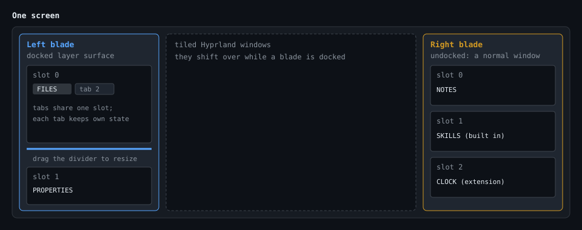

This file was written by an agent.

# Architecture

---

FileBlade runs as a native Quickshell application with a resident Rust authority.
The legacy Omarchy Quattro plugin entry remains available for compatibility.
Both shapes share the blade services and extension contract described here;
[native installation](docs/agent-written/native-install.md) documents standalone
process ownership, persistence and desktop integration.


## The two halves

### QML side

The native app owns its Quickshell view; the legacy plugin loads `Service.qml`
inside omarchy-shell (`keepLoaded: true` in `manifest.json`). The visual services
share this structure:

```yaml
Service.qml:                 plugin entry; owns the host, the IPC handlers, and shared services
blades/BladeHost.qml:        the layout model; reads and writes blades.json, routes focus, holds the module registry
blades/BladeRegistry.qml:    finds modules (built in, yours, other plugins); see EXTENSIONS.md
blades/BladeSurface.qml:     one docked PanelWindow per edge per enabled screen
blades/BladeWindow.qml:      one ordinary window per undocked edge
blades/BladeSlot.qml:        loads a module's entry QML and hands it a BladeContext
blades/BladeModuleLoader.qml: gives each loaded module its own context through replacement and teardown
blades/BladeContext.qml:     the API a module talks to: state, focus, services, tabs, drag
blades/BladeFocusController.qml: focus routing, restoration, and pointer-follow logic
blades/BladeSettings.qml:    the per-blade slot editor (the gear in the blade, or `fileblade blade settings`)
modules/files, properties, notes, welcome:  the bundled modules; welcome is seeded into the right blade on first launch until installed or dismissed
controllers/*.qml:           state machines: tree, search, selection, operations, watches, trash, config, updates
panes/*.qml:                 the views the files module is made of (tree, trash, favorites, picker, actions menu)
ui/*.qml:                    shared widgets; PaneHeader, HintTip, ActionDialog, ArtifactBin, ImageGrid, TimelineScrubber, and so on
blades/BladePopout.qml:      hosts one module outside a blade, for a bar widget's dropdown
lib/*.js:                    pure helpers: key routing, search syntax, icons, formatting, tree order
```

One rule the test suite enforces: only `controllers/BackendClient.qml` may own
a `Process`. Modules and panes never spawn anything themselves. They ask the
backend.

The slot's tab bar follows the current layout, while each loaded module retains
its original module/provider identity. Replacing a tab retires its context
before unloading it: reads cannot switch to another tab's state, and late state
writes or focus requests cannot affect the replacement. Provider lookup remains
live for enable/disable changes, but never changes to a different provider.

### Rust side (`fileblade`)

The `fileblade` script launches the bundled static x86-64 `fileblade-bin`.
`FILEBLADE_BINARY` overrides it for development or packaging; local Cargo
artifacts and `/usr/bin/fileblade-bin` remain fallbacks. The binary is both
the public CLI and the backend:

```yaml
src/main.rs, src/public_cli/:       the `fileblade` CLI you and your agents use
src/server/, src/backend/:          `fileblade serve` and its shared request dispatcher
src/command.rs, src/secure/:        running external tools safely; descriptor-relative opens
src/filesystem/, src/operations.rs: copy, move, rename, delete with staging and no-replace publish
src/listing.rs, src/index.rs:        directory listing and the gitignore-aware index
src/search/, src/grep.rs, src/frecency.rs, src/quicknav.rs: search, ranking, and quick navigation
src/visibility.rs: shared hidden, tagged-cache and private-state visibility
src/git.rs, src/git/:                git status snapshots, batching, cache, and gitignore state
src/journal/, src/audit.rs:          undo/redo journal and the append-only audit log
src/trash/, src/artifact_bin/:       Freedesktop Trash and per-module bins for disabled items
src/drop_target/, src/hyprland/:     drag-and-drop to the desktop and the drop wheel
src/actions/:                        script actions: manifest normalization, discovery, and execution
src/updates.rs:                      the opt-out update check
src/shell_init.rs:                   `fileblade shell bash|zsh` keybinding snippets
crates/fileblade-output:             text and JSON output shared by every command
```

Quick navigation merges the gitignore-aware home-directory index with zoxide's
known locations. The index makes unvisited folders discoverable; zoxide scores
rank otherwise-equivalent matches and can contribute visited paths outside the
home tree. If zoxide is unavailable, folder discovery continues without those
frequency scores.

## How the QML talks to Rust

`BackendClient.qml` starts `fileblade serve` once, keeps it alive, and
restarts it with backoff if it dies. The protocol is newline-delimited JSON on
stdin and stdout, version 1:

```yaml
hello:       handshake in both directions, carries `v: 1`
request:     { v: 1, type: request, id, generation, command, arguments: [...], deadline_ms }
response:    { v: 1, type: response, id, generation, ok, late, payload }
progress:    streamed while a long operation runs (copy, move, deep search)
subscribe:   a watch the backend keeps open; it emits `event` frames until cancelled
             topic `filesystem`: an inotify watch on a bounded list of paths
             topic `mounts`: POLLPRI on /proc/self/mountinfo plus inotify on /dev/disk/by-id
                             and /run/media; each frame carries the whole volume list and a
                             fingerprint of the mount table, so a tmpfs or bind mount still emits
cancel:      stop a request or a subscription by id and generation
error:       the backend refusing a malformed or oversized frame
```

`capacity --path P` answers with the filesystem numbers under the toolbar
bar: `fstatvfs` on the opened canonical directory, the mount record found
through that directory's `STATX_MNT_ID`, `df`'s `used / (used + available)`
fraction and its rounded-up percentage, all computed once in Rust and shared
with the Drives volumes. Counters that cannot be trusted (a zero fragment
size, free above total, available above free, or the all-ones unknown value)
leave `fraction` and `percent` null. One probe runs at a time: a second
request while one is outstanding answers `busy` at once, and the flag clears
only when the blocked probe returns, so a stalled network filesystem cannot
pile up workers. `fileblade space [PATH]` calls the same command directly and
prints one line or, with `-o json`, the document.

This file was written by an agent.

Skills, Memory, Hooks and MCP ship as built-in modules. Welcome does not acquire
or install companion repositories.

Plugin storage paths are resolved before reading manifests, so a symlinked
plugins directory works; manifest reads remain bounded and reject symlinks.

The `generation` number is how a controller ignores stale answers. Change the
root mid-search and the old results get dropped on arrival instead of
flickering in. The server also enforces limits so a bad request can't take the
shell down with it: 1 MiB per line, 32 MiB per response, a default 15 s
deadline (15 min max), configurable concurrency from 1 to 32 requests, and 512
watched paths. The CLI defaults to 8 requests; the shell starts it with 16.
Progress renews a request's deadline. Mutations are allowed to finish after
their deadline and report `late`; read cancellation is cooperative. It sets a
parent-death signal so it dies when the shell does.

All default opens cross `controllers/LaunchController.qml`. It sends files to
their desktop default application, but routes directories back through the
Files module's validated navigation path. The shared `openDefault` service
therefore behaves the same for built-in panes, public IPC, and every plugin;
an omitted directory hint is resolved with a bounded `stat-batch` request.
The Rust-side default-open helper follows the same rule for drop-wheel opens.

## Blades, slots, tabs, modules



```yaml
blade:   one screen edge, left or right. Open or closed, docked or undocked, focused or not.
         Rendered by one BladeSurface per screen; `monitorMode` decides which surfaces are
         eligible. `active` (default): each edge shows only on the monitor Hyprland had
         focused when that blade was opened, and stays there until closed; a shortcut
         pressed while working elsewhere closes it, the next press opens it there.
         `locked` + `monitorLock`: only that named output, and shortcuts always act there.
         `all`: mirrored on every output (legacy `primary` becomes a lock to the first).
         The layout itself is one shared document; only the per-edge invocation screen is
         runtime state, adopted from the first focused monitor after a restart.
         `lib/MonitorMode.js` is the single resolver; `BladeLayout.preferredScreen(edge)`
         is where every unscreened command lands and is null while nothing is eligible.
         Explicit ineligible targets are rejected, never redirected. A mode or lock change
         that makes the owning screen ineligible drops focus ownership without touching
         application focus and cancels an unanswered trash confirmation
slot:    a vertical section of a blade holding one module; drag the divider to resize, collapse it, reorder it
tab:     alternate module instances inside one slot, each with its own persisted state
module:  the QML a slot loads; found by the registry, described in EXTENSIONS.md
```

Layout is one file, `~/.config/omarchy/fileblade/blades.json`:

```yaml
version: 1
monitorMode: active | all | locked
monitorLock: ""  # named output when locked
animations: true
fontScale: 1.0
blades:
  left:
    open: true
    width: 517
    mode: docked | window
    slots:
      - id: files
        modules: [ { module: files, state: { root: "~" } } ]
        active: 0
        collapsed: false
        fraction: 0.595
  right: ...
```

It's written atomically and watched, so editing it by hand or through
`fileblade blade set|add|remove|move-slot` updates the live UI without a
restart. Slots render through a Repeater over `slots.length`, not over the
array, so a save never tears down and reloads every module.

Docked blades are layer surfaces with an exclusive zone, which is why your
tiled windows shift over. An undocked blade (Super+T while it has focus) is a
plain Hyprland window you can tile and move like anything else. Its screen is
chosen once when entering window mode from the edge's invocation or lock
target. Later compositor movement is retained, and focus reports use the
native window's actual screen. Removing an output cancels its transient
menus, wheels, drags and keyboard ownership; the saved lock is retained.

### Popouts

A module can also live under a bar icon. `blades/BladePopout.qml` builds a
`BladeContext` with `popout` set, so the module sees `edge: "popout"`, keeps its
state in memory for the shell session, and closes the popout instead of a blade.
The widget belongs to the plugin that wants it; FileBlade only supplies the
host, because a `bar-widget` kind on FileBlade itself would make Omarchy report
it as disabled to every satellite's host guard unless a bar entry named it.
`src/plugin_catalog.rs` reads `shell.json` for plugins that carry `bar-widget`
beside another kind and treats a `plugins[]` or bar-layout entry as enabled.

## Focus and keybindings

Backend hover and drop hit testing resolve the logical point to its output
and that output's shown special or active workspace. Explicit native-window
focus checks the window's own output workspace. Direction routing receives
each edge's monitor name and rejects blades anchored elsewhere, including on
empty workspaces. An empty home name represents mirrored All mode.

Pane-navigation bindings live in the user-owned
`$XDG_CONFIG_HOME/omarchy/fileblade/keybindings.json` (defaulting to
`~/.config/omarchy/fileblade/keybindings.json`). See the
[keybindings reference](docs/agent-written/keybindings.md) for actions and syntax.
`KeybindingsController` watches changes and uses the backend's bounded,
no-follow reader; invalid edits preserve the last valid map. `TreeKeys` resolves
the same map in Files, Properties and satellite artifact trees. Key sequences
are local to pane focus, cancel on focus loss/reload, and retain the shared
held-key guard. No config text is executed as code.

`BladeFocusController` routes focus requests, and each `BladeSurface` owns an
on-demand keyboard focus setting and a `HyprlandFocusGrab`. The grab keeps
keyboard input in the blade while the pointer rests over an application.
Outside clicks clear it; `BladePointerFocusWatch` also checks for real pointer
movement over application windows. That check starts at 80 ms and backs off
to 480 ms while the pointer stays still. Moving inside a slot can focus that
slot. While a docked blade has focus, FileBlade sets other windows' active
border color to the compositor's inactive color.
Focus ownership includes the monitor and a request revision. Deferred work
and cleared grabs from superseded surfaces cannot change the current owner.
The backend records each affected window's prior border color and restores
owned changes when focus leaves or the server shuts down, including SIGTERM.
Quickshell kills child processes immediately when their QML owner is destroyed.
Teardown therefore also launches one bounded cleanup command: it waits for the
old backend to exit, then restores only borders still owned by that backend.
A newly loaded backend can take ownership without an old cleanup undoing it.

An external open is also a focus boundary. `LaunchController` asks the blade
host to yield before it starts an editor, desktop default, explicit
application, or reveal action. Yielding closes an action menu, releases an
open drop wheel's exclusive keyboard focus, releases every docked focus grab,
cancels deferred focus timers and stale focus or undocked-placement requests,
and forgets the old workspace focus instead of restoring it over the
application being opened. The drop wheel uses
the same boundary before file or mixed batches, direct path pastes, and every
action that opens or targets an editor, terminal, multiplexer, or application;
known target windows are explicitly focused after their operation. A drop
target whose process is shared by another mapped window (single-process
terminals) cannot be resolved through its process tree; `context.rs` marks it
shared and resolves a herdr pane only when the live window title names one
workspace across the herdr sessions found in that tree, revalidating title,
process and pane at execution, while tmux and nvim in such a window are
ambiguous. Ambiguous targets carry `ambiguous` and `reason`, lose their mux,
hunk-pane, nvim and pane-paste actions, and the backend refuses those actions
with the reason. New backend
wheel actions default to this external boundary unless the focus policy marks
them as local. Directory-only opens stay inside FileBlade and keep blade focus;
in a mixed batch, folders navigate in the background and cannot reclaim focus
from the application opened for the files. Multi-file edits use one editor
launch; a default-open batch may map several clients, but FileBlade stays out
of the focus race and Hyprland leaves the last activated client active.


FileBlade does not edit your Hyprland config. The blade-aware binds in the
README live in your own config and ask FileBlade first with a short timeout,
then fall back to Hyprland's Lua dispatcher when IPC fails. The complete block
is [examples/fileblade-bindings.lua](examples/fileblade-bindings.lua); its
fallback expressions are shell-quoted as single arguments. The calls suppress
output with redirection, not `omarchy-shell -q`, because `-q` returns success
even when the target is unavailable and would prevent the fallback:

```lua
local function blade(method, fallback)
  local call = "timeout 0.4s fileblade native ipc -- data-goblin.fileblade.control " .. method .. " >/dev/null 2>&1"
  if fallback then return call .. " || hyprctl dispatch " .. string.format("%q", fallback) end
  return call
end

o.bind("SUPER + B", "Open or close the left blade", blade("toggleBladeFocus left"))
o.bind("SUPER + W", "Close window or blade", blade("windowClose", "hl.dsp.window.close()"))
o.bind("SUPER + LEFT", "Focus left (blade aware)", blade("focusDirection l", 'hl.dsp.focus({ direction = "l" })'))
```

The methods behind those binds: `toggleBladeFocus`, `focusDirection`,
`windowClose`, `windowToggle`, `windowSwap`, and the resize pair. Inside a
blade, keys are routed by `lib/KeyRouter.js` and each module's own handler;
press `?` in any blade for the live cheat sheet.

## IPC and the CLI

Two Quickshell IPC targets, split on purpose:

```yaml
data-goblin.fileblade:          read only: status, tree, searchResults, selection, history, favorites,
                                blades, bladeModules, actions, actionResult
data-goblin.fileblade.control:  mutating: everything else
```

The `fileblade` CLI wraps both. Most commands go over IPC to the live plugin;
a few (`list`, `preview`, `archive-list`, `extract`, `log`, `shell`,
`extension template`) run the Rust code in-process and work with the shell
down. `--output json` on
anything gives you machine-readable output, which is what agents should use.

The CLI dispatches live file operations directly to the control target.
Irreversible Trash commands still require an explicit `--yes` argument.

### Filesystem path identity

Actionable paths are absolute strings: plain paths for UTF-8 names, canonical
percent-encoded local `file:///` URIs for names containing non-UTF-8 Unix bytes.
The backend decodes these with `common::parse_path`; QML uses `PathText.js` for
comparison, ancestry, joining and rename remapping. Do not build a path from a
row's display name or run a URI through a plain filesystem-path constructor.

Display names escape invalid bytes, control characters and literal backslashes
so distinct names remain distinguishable. Rename dialogs preserve these escapes
only when the original name requires them; `--name-escaped` is the corresponding
backend option. Native command arguments, journals, Trash, search results and
artifact-bin manifests retain the original bytes. Terminal path quoting uses
Bash/Zsh byte escapes when needed.

Helpers inherit these operations through `context.paths` and the same codec in
`src/common/path.rs`, which the core modules share. Actionable output fields are
marked as native paths; filesystem operations still receive the original bytes.
Display sanitization and output bounds must never rewrite or truncate an action
path. `tests/run` checks the Rust codec alongside the QML implementation.

This file was written by an agent.

Captured native commands share `src/command/`. Rust's normal `Command` setup
preserves native arguments, environment, working directory and exec errors.
A private Linux supervisor owns each command group, retains the leader's PID
through cleanup, and monitors backend death through a pidfd. The request worker
polls nonblocking stdin, stdout and stderr without per-pipe threads or a copied
input buffer. Completion drains remaining output for a bounded interval;
independent daemons cannot hold the request open. Explicitly detached desktop
launches retain their separate lifetime. The guardian enters through `pre_exec`
and uses `_Fork` to avoid pthread atfork handlers in the multithreaded backend.
Its child-side supervision uses fixed stack storage and async-signal-safe calls:
no allocation, Rust locks, or destructors. It keeps the leader unreaped through
the final group signal so that PID reuse cannot redirect cleanup. Private control
descriptors are duplicated above stderr before command stdio setup; all other
guardian descriptors are closed. Adopted children in independent groups are only
reaped after exit, never killed.

A helper entry may be any executable that speaks JSON over stdin and stdout;
the contract names no language. An external helper that spawns its own commands
owns their lifetime itself. Commands the backend spawns for it go through the
same supervisor: bounded streams, a deadline, and the owned process group
stopped on cancellation or caller death.

`ui/ArtifactInventory.qml` shares provider-owned JSON discovery and mutations
over the resident backend's `helper-read` / `helper-write` requests. The backend
resolves a manifest-declared helper and method rather than accepting an
executable from a row. Native supervision bounds its streams and lifetime;
private request input is forwarded on stdin. The built-in Skills, Memory, Hooks
and MCP routes are answered in process by `src/core_modules/` instead of a
spawned program, and collect source directories for the existing filesystem
subscription protocol.
Memory uses this runtime, leaving its visual module responsible for presentation.

### IPC verbs without a CLI subcommand

Every function exported by `FileTreeIpc.qml` is public API: reachable with
`fileblade native ipc -- data-goblin.fileblade.control <verb>` whether or not the
`fileblade` binary wraps it. The contract test
`exported_ipc_verbs_have_a_cli_caller_or_a_documented_reason` fails when a new
export appears that neither `src/public_cli/` calls nor this list names, so
adding a verb means deciding its status here.

```yaml
setMonitorMode: blade settings Monitors choice (active | all | locked <monitor>); VM section 34
windowClose:    host bind (Super+W) through bindings.lua
windowResize:   host bind (Super+Minus, Super+Equals)
pointerResizeBegin: compositor global shortcut fileblade:resize-blade, bound to Super and the right mouse button
pointerResizeEnd: compositor global shortcut fileblade:resize-blade-end, the release half of the same gesture
windowSwap:     host bind (Super+Shift+arrows)
windowToggle:   host bind (Super+T)
focusLeft:      host bind (Super+Left)
setScrollMarks: settings sheet toggle for Git marks on the scroll ruler; the VM expectations flip it
setAutoHideSearch: settings sheet toggle for hiding unfocused search bars; VM section 32 checks visibility and persistence
focusRight:     host bind (Super+Right)
focusBladeOn:   host bind helper, focuses a blade on a named screen
quickNav:       in-app key (Shift+Z); no host bind
undo:           host bind (Super+Z), also the in-app undo
reloadKeybindings: explicit reread after editing the user keymap; normally handled by its file watcher
cancelPick:     picker dialog flow, driven by the pick blade itself
openBranches:   `fileblade branches`; also the Expand row of the Switch branch popup; opens or focuses the Branches module in the left blade
closeBranches:  `fileblade branches close`; removes the Branches module
confirmPick:    picker dialog flow, driven by the pick blade itself
pickerResult:   picker dialog flow, answer from the pick blade
select:         single-path form of selectEntries, which fileblade select uses
setWelcomeState: Welcome tab flow; VM section 29 resets the first-launch state
setModeBadge:   Files settings row for the Neovim mode badge (header, footer, hidden); VM section 17 flips it and reads status.modeBadge
welcomeInstall: Welcome tab flow; starts the detached four-extension installer
welcomeDismiss: Welcome tab flow; closes the tab and records the choice
resetBladeLayout: applies the default blade layout, which seeds the Welcome tab while it is pending
revertDefaults: the settings sheet's "Revert to default settings" link after its confirmation; resets the files settings to their config defaults and applies the default blade layout, leaving favorites, folder colours, navigation history, and key bindings alone
pin:            single-entry form of pinMany, which fileblade pin uses
unpin:          single-path form of unpinMany, which fileblade unpin uses
```

## Selection is shared

Modules don't talk to each other directly. `context.service("files")` returns
the files controller, and its `selectedPath` and `rootPath` are what the
properties module and the satellite plugins watch. The same selection is what
`fileblade selection` prints, so an agent and a module see the same thing.

Folder-scoped modules use `contextPath`: it is the selected folder, or the
opened `rootPath` when the primary selection is a file or empty. The persisted
`projectContext` setting can instead make it the nearest Git project root.
`projectRoot` remains available separately for consumers that are inherently
repository-wide.

Manifest-contributed modules also receive their owning plugin id as
`context.providerId` and its singleton Omarchy service as
`context.providerService`. `context.service(id)` resolves FileBlade-owned
services first and then delegates to the shell service registry. A provider
service owns shared processes, watchers, caches, and mutations; slot QML owns
only per-instance presentation and persisted `context.state`. This prevents a
module shown on multiple screens from multiplying background work.

## What happens on a file operation

1. The files module asks the backend (`copy-to`, `move-to`, `rename`, `trash`, ...)
2. Rust stages the work privately (a `0700` staging dir for copies, a
   quarantine name for cross-filesystem moves), verifies the source didn't
   change, then publishes with a no-replace rename
3. A journal entry lands in `journal.json` for undo/redo, with fingerprints so
   a changed destination is refused rather than clobbered
4. An audit line lands in `audit.jsonl`
5. Progress frames stream back; the UI shows them and lets you cancel
6. inotify events refresh the tree and replace the affected cached git status
   snapshot; ordinary navigation reads that snapshot instead of running git again

Trash goes to the Freedesktop Trash so Nautilus sees it too. Retention cleanup
runs on the schedule in settings (7 days by default) and only removes entries
whose recorded deletion time is old enough.

## Where things live on disk

```yaml
~/.config/omarchy/fileblade/blades.json:        layout and per-tab module state
~/.config/omarchy/fileblade/modules/:            your own modules (see EXTENSIONS.md)
~/.config/omarchy/fileblade/config/<id>/:        a module's own config directory (context.configDir)
~/.config/omarchy/fileblade/actions/<id>.json:   your own script actions (see EXTENSIONS.md)
~/.local/state/omarchy/fileblade/state.json:     files settings, favorites, colors, columns
~/.local/state/omarchy/fileblade/journal.json:   undo/redo, at most 100 entries
~/.local/state/omarchy/fileblade/audit.jsonl:    selected mutation audit records; rotated at 32 MiB
~/.local/state/omarchy/fileblade/frecency.json:  the quick-nav ranking
~/.local/state/omarchy/fileblade/agent-usage.sqlite3: skill and MCP use history (docs/agent-written/agent-usage.md)
~/.local/state/omarchy/fileblade/modules/<id>/:  a module's own state directory (context.stateDir)
~/.local/share/fileblade/bin/:                   artifact bins for disabled satellite items
~/.local/share/Trash/:                           the normal Freedesktop Trash
~/.cache/fileblade/thumbnails/:                  rendered image previews
```

Private JSON state uses `0700` directories, `0600` files, and atomic writes
with `fsync`. The audit log appends in place, and thumbnail permissions follow
the process umask. SECURITY.md describes those exceptions and the current
limits of change detection and cancellation.

## Configuration

Every key lives under the plugin's settings object in `shell.json`
(`fileblade settings`, or edit the file). Saved
state in `state.json` wins over these once it exists; the keys are the first-run
defaults and the values for anything the state file does not carry.

```yaml
startOpen:                  false      open the left blade when the shell starts
sidebarWidth:               380        files blade width in px (280 to 1600)
propertiesBladeWidth:       360        properties blade width in px (280 to 1200)
propertiesPlacement:        below      where the properties pane docks: above, right, below
propertiesVerticalFraction: 0.34       height share of the properties pane when it is below (0.18 to 0.72)
showHidden:                 true       show dotfiles
rootPath:                   ~          tree root
priorityProperty:           modified   the first metric column
gitEnabled:                 true       compute and display Git status metadata
projectContext:             false      use the nearest Git project instead of the selected/open folder as shared context
propertyIcons:              true       glyphs in the metric columns
confirmTrash:               true       ask before moving to Trash
scrollMarks:                true       Git status marks on the tree scroll ruler
folderColorScope:           icon       what a folder color paints: icon, name, or row
trashRetentionDays:         7          days before Trash entries are pruned; 0 keeps them forever
gitStatusPollIntervalMs:     5000       Git fallback base in ms; 6x while inotify is healthy, 0 disables it
dropModifier:               space      drop-wheel hold key: space, alt, ctrl, shift, or meta
monitorMode:                active     invocation monitor; all mirrors, locked uses the saved monitorLock
animateBlades:              true       slide blades open and closed
checkUpdates:               true       the six-hourly ref lookup described under Checkout update checks
blades:                     omitted    optional full first-run left/right layout; supersedes the legacy layout keys above
```

Folder colours are configured separately, in a user-owned file FileBlade reads
but never writes: `$XDG_CONFIG_HOME/omarchy/fileblade/colors.json`. Each entry
replaces one swatch of the folder colour palette; omitted keys keep the theme
colour (red, yellow and green shifted away from the Git status hues, see
`lib/FolderPalette.js`). Values are six-digit hex colours; anything else is
ignored with a warning and the previous palette stays. Edits apply without a
restart.

```json
{
  "version": 1,
  "folder": {
    "red": "#f38ba8",
    "yellow": "#f9e2af",
    "green": "#a6e3a1",
    "blue": "#89b4fa"
  }
}
```

Keys: `red`, `orange`, `yellow`, `green`, `cyan`, `blue`, `magenta`, `muted`.

# Git

FileBlade has two independent Git integrations. The files module decorates
working trees with live repository metadata, while the update checker compares
the FileBlade and enabled satellite checkouts with their upstream branches.
Both integrations are read-only. Update checks read remote branch and tag IDs
without fetching objects, changing refs, or altering checkout files.

## Working-tree metadata

With `gitEnabled: true`, directory listings and searches ask the Rust backend
to find the nearest `.git` marker and decorate their rows. Normal repositories
and linked worktrees are both supported: a marker may be a directory or a
regular `gitdir:` file. One `git status --porcelain=v1 -z
--untracked-files=all --ignored=no` snapshot supplies all staged, unstaged,
untracked, renamed, conflicted, and deleted entries for a repository;
`git check-ignore -z --stdin` supplies ignore state for only the paths being
shown. File and search rows receive their exact index and worktree state, while
directories receive aggregate modified, deleted, and new counts for their
descendants. Repository roots also expose the repository name, branch, and
worktree name.

Git commands run with `core.fsmonitor=false` and `GIT_OPTIONAL_LOCKS=0`, so
reading status does not wake a repository's own fsmonitor or take optional
locks. Requests are cancellable and bounded: a single status has a four-second
and 4 MiB limit, at most 100,000 status entries are parsed, metadata batches
accept at most 1,000 paths, and their repository snapshots are capped at 16
MiB in aggregate. A missing or failed Git executable leaves ordinary file
metadata usable and reports the Git error separately.

## Resident snapshots and refresh

Directory paging caches one sorted/filtered index per directory, not copies
of every metadata row. Each returned page reads its current metadata. Directory
changes, filesystem events, mutations, explicit refresh, and a five-second
expiry invalidate the order. Metadata search filters run before candidate
limits, and interrupted work is reported as partial.

`fileblade serve` owns an in-memory, 64-repository status cache. The first read
of a repository runs `git status`; ordinary tree navigation, paging, and search
reuse that snapshot instead of spawning Git again. A successful explicit
refresh atomically replaces the snapshot. If refresh fails, the last successful
snapshot remains available with the new error attached.

The QML side registers each repository root and Git directory returned by Rust.
Its inotify subscription covers expanded filesystem directories and those Git
directories. Worktree events refresh the affected visible directories and mark
only their repository's snapshot dirty. Git-directory events refresh status
only for decoration-relevant state such as `index`, `HEAD`, refs, logs, and
merge or rebase heads; transient lock files and unrelated Git-directory noise
are ignored. Events are debounced, repository-scoped refreshes are batched, and
at most 1,000 currently visible tree, search, favorite, and recent paths are
redecorated. Row fingerprints prevent an unchanged snapshot from rewriting the
models.

`gitStatusPollIntervalMs` is a fallback for missed or unavailable events. Its
base is 5 seconds, but a healthy watcher stretches that to 30 seconds and
unchanged polls back off to four times their current interval. A real change,
navigation, or tree structure change resets the backoff; `0` disables polling.
Opening the blade, a watcher overflow, and a deliberate tree refresh request a
full refresh. Turning `gitEnabled` off stops both refresh paths, sends
`--no-git` on listings and searches, and clears Git presentation from every
model.

The capacity bar keeps three ideas apart: eligible (the root is a local
directory, not Trash, Recent, Drives or a remote root), demanded (at least one
visible, open, uncollapsed Files pane has the setting on) and loaded. A root
change bumps the generation, cancels the pending request and clears the old
numbers before the 400 ms debounce sends one `capacity` request with a 5 s
deadline. Completed operations, Trash operations, mount changes, the manual
refresh and backend readiness reschedule it; a failure retries with backoff
from 1 s to 30 s while the pane still demands it; a 60 s tick catches writes
made by other programs. The Drives list samples on mount events only, so a
volume row may lag the bar until the next such event.

## Checkout update checks

This file was written by an agent.

When a blade opens or saved state loads, and the last attempt is older than six
hours, FileBlade checks its checkout and enabled blade providers with one
`git ls-remote` per repository. Each request includes the configured upstream ref
(or origin HEAD for detached installs) and `refs/tags/v*`, with a 20-second deadline,
64 KiB stdout, 16 KiB stderr and 512-ref caps. The attempt is saved before the
request; `checkUpdates: false` disables automatic checks. No objects, refs or
checkout files are downloaded or changed.

A valid version from the remote commit's locally available manifest takes
precedence. Otherwise the highest SemVer release tag must resolve to that exact
commit, using the peeled commit for an annotated tag. Version strings are capped
at 64 bytes. This follows the release convention that `vX.Y.Z` matches the manifest;
it does not claim to verify an unavailable manifest. Untagged tips and unavailable
versions get versionless notices. SemVer precedence distinguishes newer, same and
older versions, including prereleases and build metadata.

The footer's Update available chip opens a notice naming the FileBlade version
followed by a Companion updates heading and one version bullet per extension,
ordered by name, without commit counts. Local work and ahead commits remain
skipped; CLI history fields use existing objects only.
The notice keeps Close and Check again, and explains that FileBlade checks only:
stop the shell before running `omarchy plugin update`, then run
`omarchy restart shell`. Disabling a pane does not stop the plugin watcher.
The checkout contains the matching backend; users do not build it. A backend
version mismatch is reported by the footer, tree status and `fileblade doctor`.

# Satellites

The agent-oriented blades from the README (skills, memory, hooks, MCP, git)
aren't in this repo. Each is its own Omarchy plugin, `data-goblin.fileblade-<x>`,
that plugs into the `data-goblin.fileblade/blade` socket. They're inert if
FileBlade isn't installed and removable one at a time. EXTENSIONS.md explains
the contract they use, and it's the same one you'd use for your own blade.
