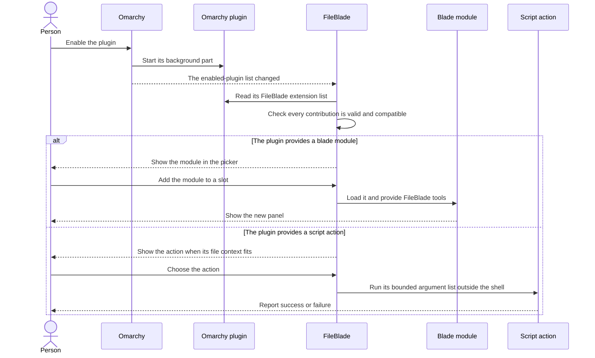
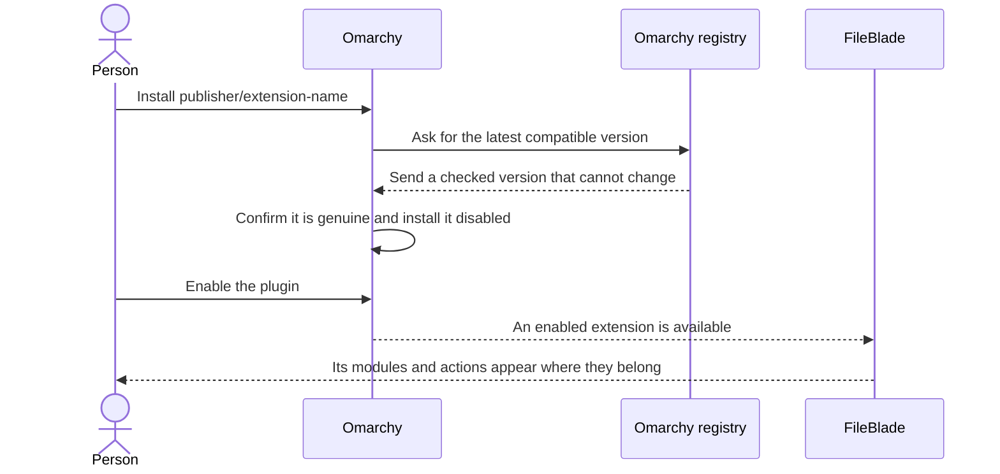
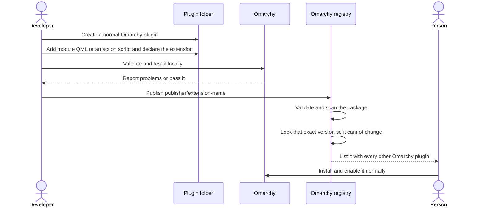

This file was written by an agent.

# FileBlade extensions


To avoid confusing FileBlade extensions with Omarchy's plugin system, this guide uses four names:

- **Omarchy plugin:** the package a person installs, updates, enables, or removes
- **FileBlade extension:** the part of an Omarchy plugin that plugs into FileBlade
- **blade module:** the actual panel that appears in a FileBlade slot
- **script action:** a safe-shaped menu row that runs a plugin's bundled program

In one sentence: install an Omarchy plugin, and its FileBlade extension can add
blade modules, script actions, or both. There is no second registration step
inside FileBlade.

FileBlade is the host. The three modules that ship with it (files, properties,
notes) use exactly the same module contract as anything you write yourself.
This page explains that contract and how to build and debug an extension. It's
aimed at both you and your agent.

The reasoning and ownership boundaries behind this contract live in
[`docs/agent-written/design.md`](docs/agent-written/design.md).

> [!NOTE]
> The example plugin at `examples/data-goblin.blade-example/` is a complete,
> working module in about 100 lines. Copy it and go.

> [!TIP]
> `fileblade extension template <publisher>.<name>` writes a complete starter
> plugin: manifest, service, host guard, one blade module, tests, docs and the
> banner generator. See [Starting from the template](#starting-from-the-template).


## What happens when an extension loads

This is the flow that already works today:



FileBlade discovers enabled Omarchy plugins and exposes the FileBlade
contributions they advertise. The Welcome tab also offers an explicit Install
action for the four example extensions: Memory, Skills, MCP, and Hooks. It
stages their public GitHub clones together, validates them with Omarchy, and
enables them through Omarchy's CLI. Other extensions are installed through
Omarchy; updates and removal also use Omarchy's commands.

This file was written by an agent.

The four example extensions (skills, memory, hooks, mcp) and generated extension
templates carry a small host guard. When FileBlade is missing or disabled, the
first enabled extension shows one pop-up naming every waiting extension. A
missing host shows an explanation and the repository URL with no install action;
the guard never downloads FileBlade. An installed but disabled host offers Enable,
which enables the local plugin and restarts the shell. While FileBlade is enabled
the guard draws nothing.

## How a person adds an extension

The next two diagrams show the target flow for the
[planned Omarchy registry](https://github.com/omacom/omarchy-plugin-registry).
Today, the install starts with a Git repository URL instead. Everything after
the plugin is enabled already works this way.

Publication currently uses the
[Omarchy marketplace submission workflow](https://github.com/omacom/omarchy-plugin-marketplace/blob/main/SUBMISSION.md).



The person installs one normal Omarchy plugin from the normal Omarchy registry.
They do not register it with FileBlade separately.

## How a developer ships an extension



FileBlade owns the small contract between the extension and the host. Omarchy
owns publishing, trust checks, installation, updates, enabling, disabling, and
removal. An extension therefore needs no FileBlade-specific store or installer.

## Where modules come from

```yaml
builtin:  modules/<id>/blade.json inside the FileBlade plugin dir
user:     ~/.config/omarchy/fileblade/modules/<id>/blade.json (quickest way to hack)
plugin:   any enabled Omarchy plugin whose manifest.json declares
          extensions["data-goblin.fileblade/blade"] (the right way to ship)
```

The first two are found by a Rust scan (the `blade-modules` backend request)
and rescanned with `fileblade rescan-modules`. The third comes straight
from the shell's plugin registry, so enabling or disabling a plugin in Omarchy
adds or removes its modules live. Plugin module ids are namespaced to
`<pluginId>/<id>`, so nobody can collide with anyone else.

The satellite repositories are worked examples of the third kind. Each has a
`manifest.json`, a provider-owned `Service.qml`, and a visual `blades/Module.qml`:

```yaml
data-goblin.fileblade-skills:  agent skills for the selected project, by scope and source
data-goblin.fileblade-memory:  agent instructions, rules, and durable auto-memory
data-goblin.fileblade-hooks:   configured agent hooks by agent, event, and scope, payloads redacted
data-goblin.fileblade-mcp:     MCP configuration inventory and editing; never starts servers
data-goblin.fileblade-git:     repository changes, commits, branches, worktrees, and explicit sync
```

Once a module is known it shows up in the blade settings picker and in
`fileblade modules`, grouped by `category`. Put it in a slot with the picker or
with `fileblade blade add right <id>`.

## The definition

Whether it's a `blade.json` or an entry in a manifest, a module definition is
this object:

```yaml
id:           required; [A-Za-z0-9][A-Za-z0-9._-]*, max 128 chars
name:         shown in tabs and the picker; defaults to the id
glyph:        one NerdFont glyph for the picker; optional
description:  one line for the picker
entry:        QML path relative to the definition; no `..`, no leading `/` (default Module.qml)
hostContract: 1, 2 or 3; a module that asks for a newer host is listed but not loadable
singleton:    true means only one slot may hold it (default true); false allows many
minHeight:    pixels the slot can't shrink below, 0 to 4096
category:     one word or a short phrase (max 32) the picker groups by; defaults to `Module` for built-in and user modules, `Plugin` for manifest ones
settings:     optional `{ defaults, schema }`; the host renders the schema in blade settings and stores values in `context.state` under each key
```

A `blade.json` holds one of these. A manifest holds a list of them under the
socket key, and can also set `hostContract` once at the top for all of them:

```json
{
  "schemaVersion": 1,
  "id": "your.plugin",
  "kinds": ["service"],
  "entryPoints": { "service": "Service.qml" },
  "extensions": {
    "data-goblin.fileblade/blade": [
      {
        "id": "clock",
        "name": "Clock",
        "glyph": "",
        "description": "A live clock that remembers its format per slot",
        "entry": "blades/Clock.qml",
        "provider": "Provider.qml",
        "hostContract": 1,
        "singleton": false
      }
    ]
  }
}
```

The `Service.qml` of a dependent plugin can be nearly empty (the example's is
three lines); the shell still needs an entry point to load the plugin at all.

### The provider a module shares

Omarchy 4.0.3 gives every third-party plugin a registry containing only itself,
so FileBlade can no longer ask the shell for your plugin's service, and your own
manifest no longer carries its source directory. Declare `provider` on the blade
contribution and FileBlade owns that runtime itself: it reads your installed
manifest from disk, creates one `Provider.qml` per plugin, and hands it to every
module of yours through `context.service(providerId)` and
`context.providerService`.

FileBlade constructs it with exactly four properties: `providerId`,
`providerRoot`, `files` and `inventoryComponentUrl`. It expects `attach(context)`
to be idempotent, `detach(context)` to release one view, and `shutdown()` to be
terminal. Creating a provider does no work; the first `attach` starts it and the
last `detach` quiets it. When your plugin is disabled the host shuts that runtime
down, so a provider must stop its watchers there.

Keep `Service.qml` as a thin wrapper around the same `Provider.qml` for older
hosts, and resolve your own directory from `Qt.resolvedUrl(".")` rather than the
manifest. A contribution with no `provider` key is treated as legacy: it still
works on a shell that discloses plugins to each other, and needs an update on a
restricted one. `"provider": null` declares a module that owns no shared state.

## What your module gets

The entry QML is loaded as a `FocusScope` with one required property,
`context`. That's a `BladeContext`, and it's the whole API. The bits you'll
actually use:

```yaml
identity:
  context.moduleId, moduleDir:            who you are and where your files are
  context.providerId:                     Omarchy plugin id for a contributed module; empty for built-in/user modules
  context.edge, slotIndex, slotId:        where you are
  context.tabIndex, tabCount:             tabs inside this slot
flags (read only, bind to them for styling):
  context.bladeOpen, bladeFocused, slotFocused, collapsed, docked, dragging
  context.host.fontScale:                 the Font size the user chose, 0.75 to 2.0; multiply your own Style.font sizes by it to follow FileBlade
state:
  context.state.get(key, fallback):       per-tab state, persisted in blades.json
  context.state.set(key, value):          same; keep it small, it's saved with the layout
directories (feature-detect with context.stateDir !== undefined; the contract version stays 2):
  context.stateDir, context.configDir:    this module's own directories, created 0700 by the backend when the module loads
  context.dirsReady:                      true once the backend has created them
  context.ensureDirs(callback):           ask for them now; callback gets { ok, stateDir, configDir } or { ok: false, error }
settings (from the definition's schema):
  context.settings.get(key):              the stored state value when it fits the row, else the row's default
  context.settings.set(key, value):       coerces against the row, then context.state.set; false for an undeclared key
  context.settings.has(key):              true when the definition declares the key
  context.settings.schema / defaults:     the normalized rows and the merged defaults
  context.category:                       the definition's category, `Module` or `Plugin` unless it set one
shared services:
  context.service("files"):               the files controller: selectedPath, rootPath, contextPath, projectRoot, openInEditor(path),
                                          openDefault(path, targetScreen?, isDir?), revealInFileManager(path, isDir, targetScreen?)
  context.providerService:                your contributing plugin's singleton service, or null
  context.service(pluginId):              another loaded Omarchy plugin service, or null
focus:
  context.requestFocus(part):             ask the host to give this slot keyboard focus
  context.focusNext() / focusPrevious():  hand focus to the neighbouring slot (Tab and Shift+Tab, by convention)
  context.reportFocus(bool):              tell the host when your activeFocus changes
slot and blade:
  context.setCollapsed(bool) / toggleCollapsed()
  context.openSettings() / toggleSettings() / closeBlade()
tabs:
  context.openTab(moduleId, state):       open another tab in this slot (default: another of you)
  context.cycleTab(delta) / selectTab(i)
drag handle:
  context.handlePressed(item, x, y) / handleMoved / handleReleased / handleCanceled
                                          wire these to a MouseArea on your title and it becomes the reorder handle
ui:
  context.ui.url("PaneHeader"):           file URL of a shared widget in FileBlade's ui/ dir
paths:
  context.paths.canonical(path):          canonical local byte URI for identity comparisons, or empty if invalid
  context.paths.parent(path):             parent identity without losing native bytes
  context.paths.join(directory, name):    join an identity and a plain relative name
  context.paths.within(path, directory):  byte-faithful containment test
  context.paths.name(path):               escaped display name, never an action argument
metrics (contract 2):
  context.metrics.options(specs):         one metric option per spec; a spec is a key ("tokens") or an object
                                          ({ key, label, shortLabel, kind }) whose fields override the standard entry
  context.metrics.option(spec):           the same for one spec
  context.metrics.kind(option):           "agents" | "date" | "number" | "text"
  context.metrics.estimateTokens(bytes):  ceil(bytes / 4); the one token estimate every blade shows
  context.metrics.textKeys:               ["tokens", "characters", "words", "bytes"]
```

`openDefault` is the shared open primitive for every module. Files go to their
desktop default application; folders navigate the Files module and bring its
tab forward. Pass `context.screen` and a known `isDir` value when you have
them. When `isDir` is omitted, FileBlade probes the path before routing it, so
third-party modules inherit the same folder behavior without duplicating it.
All shared primitives that leave FileBlade (`openInEditor`, `openAtLine`, file
`openDefault`, `openWithApplication`, and `revealInFileManager`) first release
the blade and any modal drop wheel's keyboard focus without restoring the
previously focused window.
The application being opened therefore becomes the only focus target; plugins
must use these shared primitives instead of spawning their own opener.

Standard metric keys are `off`, `agents`, `status`, `updated`, `created`,
`tokens`, `characters`, `words`, `bytes`, `summary`. Ask for them by key and
your column labels match every other blade; pass an object to rename one
(`{ key: "tokens", label: "Tokens (descriptions)" }`) or to add your own.

Host contract 2 adds `context.metrics` and passes the wanted state on the
all-agents signal (below). A module that declares `hostContract: 2` is listed
but not loadable on a contract 1 host.

`context.service(id)` checks FileBlade's built-in services first, then asks the
Omarchy shell for the loaded service with that plugin id. For a module supplied
through a plugin manifest, `context.providerService` is the same lookup using
`context.providerId`; it remains `null` when the provider has no loaded service.
Treat either result as nullable because enable, disable, and shell reloads can
change service availability.

A loaded module keeps its own context identity until destruction. Changing the
slot's active module does not redirect that context to the incoming provider.
When replacing a module, the host sets its context's `bladeOpen` false and
refuses further state writes and focus requests. Persist presentation changes
as they occur; accepted shared work belongs in the provider service.

`context.stateDir` and `context.configDir` are
`~/.local/state/omarchy/fileblade/modules/<id>/` and
`~/.config/omarchy/fileblade/config/<id>/`, with the `/` in a plugin module id
written as `+` (`data-goblin.blade-example/clock` becomes
`data-goblin.blade-example+clock`). The backend creates them `0700` when the
module loads; `context.dirsReady` says when, `context.ensureDirs(cb)` when you
cannot wait. Keep large or shared things here, not in `context.state`. They are
private to you, not to your module: any plugin in the shell can read them.

The visual module is instantiated once for every slot that displays it, and
potentially once per screen. Keep per-tab presentation state in
`context.state`, but put shared scanners, subprocesses, watchers, caches, and
mutation logic in the provider's `Service.qml`. The module should bind to
`context.providerService` instead of starting another copy of that work. This
also gives the service one teardown boundary when the companion plugin is
disabled or the shell reloads.

For JSON inventories, load `context.ui.url("ArtifactInventory")` once in the
provider service. Bind its `observers` to the active view contexts, and supply
`files`, `providerId`, and `providerRoot` from the host context and injected
manifest. Views attach when open and expanded, and detach when hidden or
destroyed. Memory, Skills, Hooks and MCP use this runtime. Search, selection and expansion
remain view state.

Declare the executable and its methods in the provider manifest:

```json
"data-goblin.fileblade/helper": [
  { "id": "inventory", "entry": "bin/inventoryctl",
    "read": ["list"], "write": ["apply"], "timeoutMs": 8000 }
]
```

The shared inventory runs two lanes through FileBlade's resident backend:
`list --project <contextPath> --json --scope project --exact` whenever the
selection moves, and `list --project <contextPath> --json --scope user --exact`
once at attach time and again only when its own watch fires. The user lane
holds rows whose scope is not `project` or `local` and must not walk the
project chain, so its `watchPaths` never include project directories; the
project lane returns only project-level rows. `--scope all` is the default for
direct CLI use and returns both. Rows from the two lanes are concatenated,
project first, and the merged array is republished only when its content
changes, so a selection change never blanks the user-level rows. Set
`exactProject: false` for helpers without `--exact`. Responses use
`schemaVersion: 1`, `ok`, `items`, `project`, and `truncated`; `itemsKey`
selects another row-array field. `watchPaths` supplies at most 512
directories. `python/fileblade_inventory.py` collects a bounded
watch plan alongside discovery, including existing parents of missing sources;
callers record each source and visited directory. A subscription is reconciled
after installation, and watch failures or incomplete coverage remain visible.
Use `refresh(true)` for an explicit refresh so partially established watches
are retried; automatic invalidation uses `refresh()` without reinstalling them.
`scanArguments` adds provider-specific listing flags. Hooks and MCP request
`--watch` for this private transport; their default CLI output does not include
native watch directories. MCP's redacted display aliases remain separate from
the inventory's captured `anchorPath` used for actions.

`mutate(method, arguments, input, callback)` accepts one write at a time and
copies its arguments immediately. An accepted write survives view closure and
project changes; provider destruction cancels it. Private input travels on
stdin, not argv. Reads cannot replace newer-project or post-mutation state.
Owners using backend requests directly can pass `true` as the third argument
to `cancelBackendRequest(id, generation, true)` during destruction to discard
callbacks. Sent requests still occupy their concurrency slot until completion.
The native transport confines executables to their declaring plugin, separates
read and write methods, enforces a 30-second maximum timeout, and retains at
most 2 MiB stdout, 4 KiB stderr, and 64 KiB stdin. These are resource and
ownership boundaries, not a sandbox for enabled plugins.

Your module can expose a few things back to the host. All optional:

```yaml
title:           string the tab bar and shortcuts overlay use
takeFocus(part): called when the host routes focus in; call forceActiveFocus() on the thing that should have it
shortcuts:       [ { title, items: [ { shortcut, text } ] } ] rendered by the `?` overlay
settings:        a Component the blade settings sheet renders for this module, below any rows the definition's schema declares
```

Style comes from the shell's `qs.Commons` (`Style`, `Color`, `Util`), so a
module that uses those matches the current Omarchy theme for free. Have a
look at `modules/notes/Module.qml` for a small real one and
`modules/files/Module.qml` for the full-fat version with settings and
shortcuts.

## Settings without QML

Declare a schema and blade settings draws the form: `string`, `integer`,
`number`, `boolean`, `enum`, `path`, the same rows Omarchy's `barWidget.schema`
uses. Read values with `context.settings.get(key)`; they are ordinary
`context.state` keys, so a module that already uses `context.state.get` needs
no change. A QML `settings` Component still works and renders below the
generated rows.

```json
{
  "settings": {
    "defaults": { "format": "HH:mm", "refresh": 60 },
    "schema": [
      { "key": "format", "type": "string", "label": "Format", "description": "Qt date format", "maxLength": 64, "placeholder": "HH:mm" },
      { "key": "showSeconds", "type": "boolean", "label": "Seconds" },
      { "key": "refresh", "type": "integer", "label": "Refresh (s)", "min": 1, "max": 3600, "step": 5 },
      { "key": "scale", "type": "number", "label": "Scale", "min": 0.5, "max": 2, "step": 0.1, "defaultValue": 1 },
      { "key": "style", "type": "enum", "label": "Style", "options": ["compact", { "value": "wide", "label": "Wide" }] },
      { "key": "folder", "type": "path", "label": "Folder" }
    ]
  }
}
```

```yaml
schema:        up to 32 rows; a row that is not an object, repeats a key, or names an unknown type is dropped (its stored value is kept)
key:           [A-Za-z_][A-Za-z0-9_]{0,63}; `id` and the JavaScript prototype names are reserved
label:         max 64, defaults to the key
description:   max 160, shown muted under the row
group:         max 64; consecutive rows sharing a group get one muted heading above the first of them, and the filter matches the group name. A QML settings Component gets the same heading from `ui/SettingsGroup.qml` (`context.ui.url("SettingsGroup")`, `title` property) placed before its rows
string, path:  maxLength defaults to 256 (cap 4096); placeholder max 64; control characters are stripped from values
integer:       min, max within plus or minus 1e9, step >= 1 (default 1); values are floored and clamped
number:        finite min, max, step > 0 (default 0.1); values are clamped
enum:          1 to 32 options, each a string (max 64) or { value, label }; a value outside the options falls back to the default
boolean:       strings "true" and "false" are accepted; anything else is coerced with !!
defaultValue:  the row's defaultValue, then defaults[key], then the type's zero (empty string, the in-range value nearest 0, false, the first option)
```

The rows render as the same widgets the rest of blade settings uses: a toggle
for `boolean`, inline choices for an `enum` with up to four options and a
picker above that, minus and plus buttons around an editable field for
`integer` and `number`, and an inline field for `string` and `path`; a `path`
row has a trailing button that fills in the selected path from the files
blade. Rows show up in the settings search by label, description, and option
labels. The example plugin's clock declares a format, a caption, and a scale
this way; see `examples/data-goblin.blade-example`.

## Script actions

A plugin can contribute rows to the file actions menu without any QML: list
them under `extensions["data-goblin.fileblade/action"]`. Each row runs an argv,
no shell, with the selection in the environment.

```json
{
  "extensions": {
    "data-goblin.fileblade/action": [
      {
        "id": "open-in-herdr",
        "title": "Open in herdr",
        "glyph": "󰑶",
        "description": "Opens the folder as a herdr space",
        "contexts": ["dir", "root"],
        "argv": ["scripts/open-in-herdr", "--space"],
        "paths": "env",
        "cwd": "plugin",
        "confirm": false,
        "timeout": 60,
        "detach": false,
        "output": "notice"
      }
    ]
  }
}
```

```yaml
id:          required; [A-Za-z0-9][A-Za-z0-9._-]*, max 64; the row key is <pluginId>/<id>
title:       required; 1 to 64 characters
glyph:       optional, max 16 characters
description: optional, max 160; shown as the row tooltip
contexts:    required; any of file, dir, selection, root, none
argv:        required; 1 to 32 items, 1024 bytes each, 8 KiB in total
paths:       env (default) or append; append adds every target as a trailing argument
cwd:         plugin (default), root, or target
confirm:     ask before running; default false
timeout:     1 to 900 seconds; default 60; ignored when detach is true
detach:      fire and forget, no capture, no exit code; default false
output:      notice (default) or silent
```

`contexts` decides when the row shows and what the script gets: `file` and
`dir` want exactly one entry, `selection` any number up to 256, `root` the tree
root, `none` nothing. `argv[0]` must be a file inside your plugin with the exec
bit; the backend re-reads your manifest at run time, so nothing the UI holds
can change what runs.

Environment: `FILEBLADE_SELECTION_JSON` (empty past 64 KiB, with
`FILEBLADE_SELECTION_FILE` naming a `0600` file instead; the unused one is
always empty, never missing), `FILEBLADE_SELECTION_COUNT`, `FILEBLADE_ROOT`,
`FILEBLADE_TARGET`, `FILEBLADE_CONTEXT`, `FILEBLADE_ACTION`,
`FILEBLADE_SOURCE`, `FILEBLADE_PLUGIN_ID`, `FILEBLADE_PLUGIN_ROOT`,
`FILEBLADE_STATE_DIR`, `FILEBLADE_CONFIG_DIR`, `FILEBLADE_CLI`,
`FILEBLADE_HOST_VERSION`, `FILEBLADE_SCREEN`. Each selection entry is
`{ path, name, dir, symlink, size, mime }`, where `dir` says the entry is a
directory. The cwd is the plugin root unless `cwd` says `target` or `root`.
Write to the state dir, never next to your manifest; a package-managed plugin
root is read only.

Output: the first line of stdout and the exit code show as a notice in the
blade; the run lands in `audit.jsonl` (`fileblade log --command action-run`).
Set `detach: true` for anything that opens a window. Timeouts are 1 to 900
seconds. Up to four captured actions run at once, and the same captured action
cannot start again until it finishes. Detached actions return as soon as they
launch and share the backend's separate, bounded detached-child pool.

From a terminal: `fileblade actions` lists what the menu would show, and
`fileblade action <key> [PATH]... --yes` runs one and prints its tail. Its
`--wait` accepts 1 to 905 seconds and defaults to the action timeout plus five
seconds. The terminal path list is also capped at 64 KiB before it crosses the
shell IPC boundary.

The example plugin ships one: `dump` writes its environment to
`last.json` in the module state dir, so
`fileblade action data-goblin.blade-example/dump . --yes` shows you exactly
what a script receives.

Your own actions without a plugin: drop `<id>.json` files in
`~/.config/omarchy/fileblade/actions/`, one action object per file with the
file name equal to the id. Their keys start with `user/` and they may name a
program on `PATH` or an absolute path. Graduate them into a plugin when they
are worth shipping.

## Starting from the template

```bash
fileblade extension template acme.fileblade-weather
cd acme.fileblade-weather
python3 scripts/fileblade-extension-image.py --png
```

The command writes into `./<id>` (or the directory you name), refuses a
directory that already has files unless `--force` is passed, and touches
nothing else. `--output json` returns the file list and the next steps as a
document.

```yaml
DIRECTORY:      where to write; defaults to ./<id>
--name:         extension name for tabs and the README; defaults to the module id in title case
--module:       blade module id; defaults to the plugin name without its fileblade- prefix
--author:       manifest author and LICENSE holder; defaults to $USER
--description:  one line for the manifest and the module picker
--repository:   git URL in the README install command; defaults to https://github.com/<publisher>/<name>.git
--force:        write into a directory that already has files, replacing only the template's own files
```

What it writes:

```yaml
manifest.json:                         one blade module, hostContract 2, two declared settings
Service.qml, Provider.qml:             the shared runtime and the legacy wrapper with the host guard loader
HostGuard.qml, HostGuard.js:           the missing-host guard the satellites carry
blades/Module.qml:                     a FocusScope that shows the selection, routes Tab, Esc, Enter and e, and exposes shortcuts
assets/fileblade-logo.png:             the logo the host guard tints
scripts/fileblade-extension-image.py:  writes assets/fileblade-extension-logo.svg with the extension name outlined under the wordmark; standard library only, --png and --host-logo rasterize with rsvg-convert
README.md, ARCHITECTURE.md, docs/agent-guidelines.md, docs/agent-written/README.md, LICENSE, .gitignore
tests/run, tests/tst_module.qml, tests/tst_host_guard.qml, tests/test_contract.py, tests/imports/:  the local gate, with a qs.Commons stub so the module loads offline
```

The same generator lives at `scripts/fileblade-extension-image.py` in this
repository; `--name "Agent Skills"` reproduces the satellite banners exactly,
so a renamed extension keeps the shared look.

## Writing one, step by step

1. `mkdir -p ~/.config/omarchy/fileblade/modules/hello`
2. Write `blade.json` there with at least `id`, `name`, `entry`
3. Write `Module.qml`: a `FocusScope` with `required property var context`, a
   title MouseArea wired to the drag handle, and `Keys.onPressed` that sends
   Tab to `focusNext()` and Esc to `closeBlade()`
4. `fileblade rescan-modules && fileblade modules` and confirm it's listed
5. `fileblade blade add right hello`
6. Iterate. QML does not hot-reload, so `omarchy-restart-shell` after each
   edit; if Quickshell keeps showing an error at an impossible line, its QML
   cache under `~/.cache/quickshell/qmlcache` is stale, move it aside
7. When it works, move it into a real plugin with a manifest so it's
   installable, and delete the user copy so the ids don't shadow each other

## Rules the host enforces

- a definition must be a bounded, regular JSON file with a safe relative entry path; anything else is skipped silently
- at most 128 modules in total; ids, names, and descriptions are length-capped and stripped of control characters
- a plugin's modules exist only while that plugin is enabled in Omarchy
- a module with `hostContract` above what the host supports is shown as incompatible, not loaded
- singleton modules can't be added twice; the picker greys them out

What the host does not do is sandbox your QML. Once a definition is accepted,
the entry file runs with the same authority as the shell. So review
third-party modules before enabling them: plain-text rendering (no
`RichText` from filesystem values), bounded models, no `Process` of their own
unless you understand why, and proper teardown. SECURITY.md has the full
checklist.

## Satellites and artifact bins

The satellite plugins (`data-goblin.fileblade-skills`, `-memory`, `-hooks`,
`-mcp`, `-git`) are the reference for a "real" plugin. The pattern they use:

- use `context.service("files").contextPath` as the exact folder scope; by default it is the selected folder, falling back to the opened folder for a file selection, while FileBlade's `projectContext` setting can switch it to the nearest Git root
- list user-scope items always, project-scope items when a root resolves
- Enter uses the module's activation handler; file-backed items open through `openDefault`, folders expand or navigate, and `e` uses `openInEditor`. `r` reveals the source location
- disabling an item moves it into an artifact bin: `ui/ArtifactBin.qml` delegates accepted changes to the core, and FileBlade Trash also lists and restores those records
- the agents column is `ui/ArtifactTree.qml` rendering `ui/AgentStrip.qml` (one `ui/AgentIcon.qml` per installed agent, accent when applied, muted when not). Feed it `installedAgents` (from `context.service("files").installedAgents`) and an `appliedAgents(item)` function; it emits `agentToggled(item, agentId, on)` and `agentsAllRequested(item, on)`, where `on` is the state the strip wants for every agent. Load any of the three through `context.ui.url(...)` to draw agents elsewhere
- metric columns come from `context.metrics.options([...])`, so "Tokens (estimated)" is spelled once, in the host

Bind `ArtifactBin.context` to the module's context, just like the tree. Its
confirmation dialog shares `context.hostWindow.actionKeys`; otherwise opening a
dialog can strand the tree's key-release state and suppress the next action.
The dialog returns focus to its live opener. Bin listing requests are canceled
on teardown; accepted changes belong to the core's `ArtifactActionController`,
so removing the pane cannot abandon their completion.

This file was written by an agent.

For logical records, supply `helperRoute` (`provider`, `directory`, `helper`)
and a `removalArguments(item)` adapter, and declare `hostContract: 3`. Declare
`prepare-remove`, `remove-prepared`, `restore` and `discard` as write methods;
preparation persists private recovery even though it preserves the source.

Core saves a visible bin entry before requesting preparation and passes a fresh
32-character hexadecimal `--transaction-id`. Preparation uses that ID as its
`recordId`; removal reuses the same record and must compare the complete payload.
Each different transaction owns different recovery, even for identical content.
Core enforces the 64 KiB wire/input limit before invoking removal. Uncertain
completion keeps recovery. Restore is idempotent and refuses conflicting later
edits. An interrupted preparation can restore using `--record-id ID --json`
without a caller payload; the helper must read its own trusted record.

`discard --record-id ID --json` durably removes that private record and treats an
already absent ID as success. Legacy entries additionally pass `--payload-stdin`
for bounded matching against stored records. Core calls discard before deleting
its visible entry; a failure keeps it visible. Restore completion is checkpointed
before discard, so cleanup retry does not repeat the source write. Unused undo
must not expire while its bin entry remains. A live companion registers a plain
route descriptor, never a disposable QML callback. Every helper request requires
the provider to be installed and explicitly enabled in the current catalog.
Contract 3 gates this protocol: older hosts display an update requirement.

### Shared tree wiring

Loading `ArtifactTree` supplies rendering, grouping, metrics, filtering,
navigation, folder expansion, cursor visibility, and file-action integration.
The module still has to bind its context and data, and connect domain actions:

```qml
Loader {
  source: module.context.ui.url("ArtifactTree")
  onLoaded: {
    item.context = Qt.binding(function() { return module.context })
    item.items = Qt.binding(function() { return module.items })
    item.view = Qt.binding(function() { return module.view })
    item.query = Qt.binding(function() { return module.query })
    item.activated.connect(function(entry) { module.openEntry(entry) })
    item.revealed.connect(function(entry) { module.revealEntry(entry) })
    item.changed.connect(function() { module.refresh() })
    item.focusNextRequested.connect(function() { module.context.focusNext() })
    item.focusPreviousRequested.connect(function() { module.context.focusPrevious() })
    item.dismissRequested.connect(function() { module.context.closeBlade() })
  }
}
```

| Behavior | Owner and required wiring |
| --- | --- |
| Navigation and cursor | `ArtifactTree` uses the host key router, preserves row identity across refreshes, keeps the scroll position anchored to the first visible row while rows are replaced, and scrolls the cursor into view only when the cursor lands on a different row. |
| Scroll ruler | `ArtifactTree` draws `ui/MarkedScrollBar.qml` along the right edge: a thin accent thumb plus coloured position marks. Marks come from `rowMark(item)`, which defaults to the item's `gitStatus` or `git_status` field (also read from `item.source`) and is coloured through the files service `gitStatusColor`. Override `rowMark` to mark rows by another status letter (`D`, `U`, `M`, `A`, `?`, `R`, `C`) or return `""` for none. Marks for rows outside the viewport render at half opacity, and the Files setting "Git marks on the scroll ruler" (`scrollMarks` in the state document) hides them in every tree. `ui/ListAnchor.qml` and `lib/ScrollMarks.js` are loadable through `context.ui.url(...)` and `context.host.pluginDir` for a module that renders its own list. |
| Module shortcuts | An optional `keyHandler(event, repeated)` runs before generic tree actions. Return `true` only for a handled key; acknowledge repeated action keys without running the action again. Shifted domain shortcuts such as Git's Diff/Fetch remain available. |
| Search options | Bind both `caseSensitive` and `regex` from the search field to the tree. `PaneSearchField.showDeepOption` defaults to `false`; enable it only when `deepToggled` has a working whole-root search handler. |
| Search visibility | Give `PaneSearchField` the module `context` (or Files `service`). It inherits `autoHideSearch`, off by default. Call `reveal()` for the configured search action, normally `/`; it focuses and selects the query. When enabled, the bar collapses on focus loss without clearing the query. Escape should clear the query and return focus to the tree. Keep the field loaded and let its visibility size the containing Loader; do not implement a separate visibility toggle. |
| File actions and dragging | A live row's `path` identifies the filesystem object being acted on. `fileActionsFor(item)` can deny whole-file actions and dragging for semantic records, missing files or inline definitions. A configuration filename is not the identity of one record inside it. |
| Editing a definition | Set `editPathFor(item)` to an explicitly resolved, unredacted source path. Editing does not require enabling whole-file rename, cut, or Trash. |
| Disabled items | `kind: "bin"` rows route activation and the context menu to `actionRequested`. Their historical paths cannot be edited, dragged, copied as files, or passed to ordinary file actions. |
| External changes | `changed` covers FileBlade history operations affecting live paths. Providers must also subscribe to their bounded source directories for external edits and newly created artifacts. |

For real directory rows, set `expandableItems: true` and
`loadFolderChildren: true`. The tree then uses `ArtifactDirectories` for lazy
`children-batch` requests, the Files row converter, and watches of expanded
directories. Nested folders, hidden-file changes and external edits share this
path; do not supply a second child cache or request queue in the module.
Collapse or view teardown releases hidden caches and callbacks. Folder reads
are batched eight at a time, with at most 256 expanded directories and 1,000
entries per folder. `folderError` reports read, watch and coverage limits; users
can open a capped directory in Files. Call `refreshFolders()` on explicit
refresh to retry incomplete watches. Custom non-filesystem trees can instead
provide `childrenFor` and handle `folderToggled` with `loadFolderChildren` off.

`zo`/`zc` expand/collapse the selected folder or group without moving the cursor.
`zO`/`zC` (also `Shift+Right`/`Shift+Left`) recursively expand/collapse that
branch and clear its descendants' expansion on collapse; siblings stay untouched.
`zR`/`zM` apply to the whole tree. Files and historical bin rows ignore
selected-folder fold commands. Recursion uses the existing
loaders, skips descendant directory symlinks, and stops when hidden, replaced,
or explicitly collapsed. A pass is capped at 256 expansion/load steps, 20,000
visible rows and 64 levels; limits appear in `folderError`. `l`, Right and `o`
enter a live folder in Files; `h`/Left select the enclosing folder or group in
an artifact inventory. Enter retains the module's ordinary activation.
The shared `z` prefix cancels on Escape or focus loss and never captures text
input. `Ctrl+B` pages up, as in the Files pane.
These bindings come from the Files service's `keybindings.plan`; modules
inherit user overrides without their own loader or key-sequence parser.
`context.service("files").keybindings.label(action)` returns the effective
binding label for a module's shortcut guide. See
[keybindings](docs/agent-written/keybindings.md) for the configuration format.

`ArtifactTree` is not a second `TreePane`: semantic records need their own
activation, apply/disable, and batch-action rules. Share the presentation and
interaction primitives; keep domain mutations in the provider. Do not copy
the Files pane's filesystem deletion or multiselection behavior onto semantic
records without an explicit capability contract.

Treat filesystem `path` and `editPathFor` values as opaque identities. They may
be local file URIs carrying non-UTF-8 Unix names. Pass them to the shared host
actions unchanged; labels and `relative` text are for display, not reconstruction.
The [path contract](ARCHITECTURE.md#filesystem-path-identity) covers native
providers and the shared QML helpers.

Python companions use `python/fileblade_paths.py` from their FileBlade
dependency. Their package initializer adds the sibling core's `python` directory
to the import path (the installed `data-goblin.fileblade` directory, or the
adjacent `fileblade` development checkout). This loads installed source only;
it does not fetch code or require a Python package installation.
Helper entry points set `sys.dont_write_bytecode = True` before importing their
packages: the plugin tree is read-only at runtime, and writing `__pycache__`
there triggers Omarchy's plugin watcher. The shared read-only-import regression
runs from each companion's `tests/run`.

Use `parse_path` at command-line and undo-input boundaries, keep native Python
strings inside filesystem operations, mark response paths with `NativePath`,
and apply `wire` before JSON serialization. Use `display` only for labels.
Structured undo payloads must explicitly encode their source paths and be
representable before changing the source; they are not display text. Redacted
MCP source labels remain non-actionable.

Python helpers that spawn commands use `python/fileblade_process.py`. Its
single-threaded Linux runner accepts bounded byte input, output caps and a
deadline. A small supervisor owns the command's process group; TERM waits for
cleanup before the helper exits, and abrupt helper death still triggers group
cleanup. Independently detached groups, including credential agents, have a
separate lifetime. They cannot hold the output reader indefinitely. This is
process ownership, not a sandbox for repository hooks or plugins.

Configuration writers use `python/fileblade_mutations.py` to retain a bounded,
byte-exact preimage and delegate publication to the native backend. The backend
checks file identity and original bytes, uses descriptor-relative quarantine
and no-replace publication, and keeps recovery intents on interruption. New
files are private `0600`; existing permission bits are preserved. Link creation
is exclusive, and unlink checks the captured symlink identity. This private
stdin-only adapter allows up to 8 MiB of configuration with a 24 MiB transport
cap; it does not widen the resident helper or artifact-record limits.

Send private text through stdin, not command arguments. Git's commit path
accepts at most 64 KiB and closes stdin after writing; Git receives the same
message through `-F -`. Invalid input is refused before optional staging.

A provider service gets the same two directories, keyed by its plugin id
instead of a module id, through the files service:

```
var fileblade = shell.serviceFor("data-goblin.fileblade")
if (fileblade) fileblade.moduleDirs(manifest.id, function(dirs) { if (dirs.ok) root.stateDir = dirs.stateDir })
```

`fileblade module-dirs <id>` prints the same two paths with the shell down.

Companions should also follow the singleton-service ownership rule above as
they adopt this host contract: one provider service owns shared discovery and
mutation work, while each blade module instance stays visual and lightweight.

If you build something that manages files on the user's behalf, use the
artifact bin rather than deleting. It's what makes "oops" recoverable.
