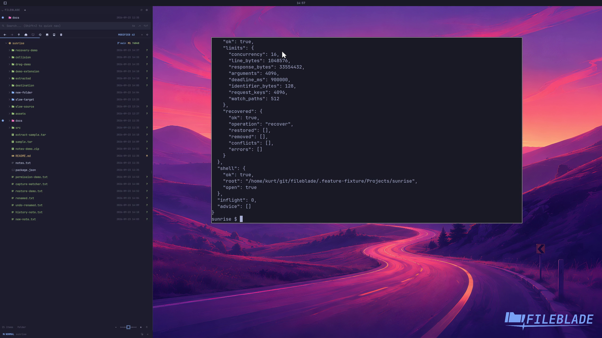

This file was written by an agent.

# Check runtime health

Use doctor to inspect the native backend, view, and recovery state. A blocked recovery is reported as unhealthy.

```sh
fileblade doctor
```

Demonstration: The live disposable runtime reports its actual health and version.

Evidence reviewed.



[Watch the focused demonstration](diagnostics.mp4) (5.97 seconds; muted, original speed).

Capture source: `c3e48bbee4f8e6c5adf0e12a3b1781ed6f6af833`. See the [evidence standard](../evidence.md) and [coverage](../catalog.json).
