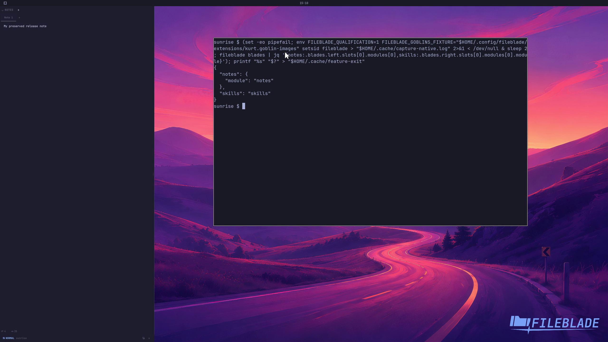

This file was written by an agent.

# Migrate legacy state

Native FileBlade reuses supported existing layout and state documents. Recognized legacy companion pane identifiers map to their built-in panes.

Demonstration: The prepared legacy layout opens with its saved state and canonical built-in pane identifier.

The demonstration uses a disclosed legacy-format fixture, not a running older installation.

Evidence reviewed.

[Watch the focused demonstration](migration.mp4) (6.97 seconds; muted, original speed).

Capture source: `c3e48bbee4f8e6c5adf0e12a3b1781ed6f6af833`. See the [evidence standard](../evidence.md) and [coverage](../catalog.json).
