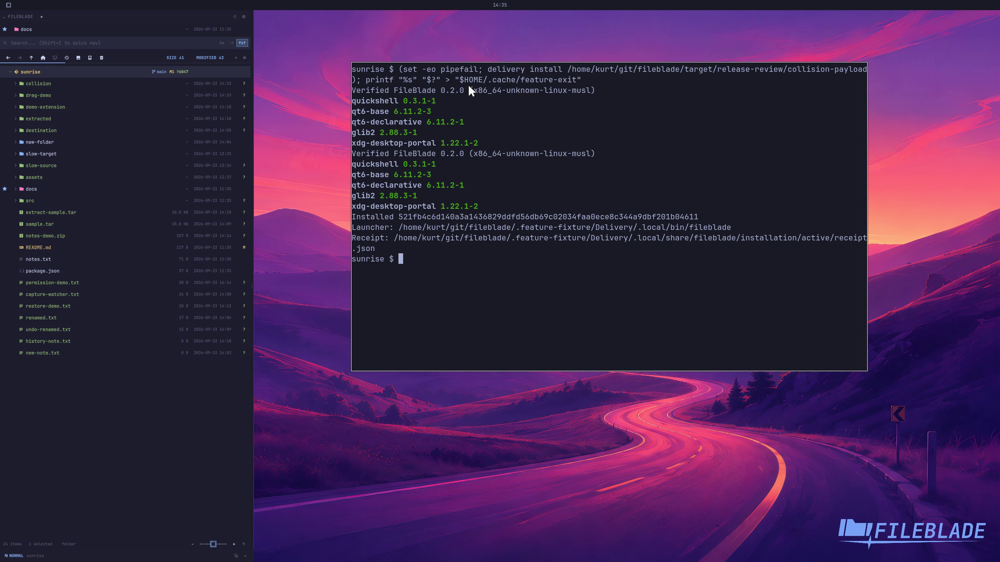

This file was written by an agent.

# Install the native app

Install a verified native payload through its included installer. The stable launcher points to an owned installation receipt.

```sh
PAYLOAD/tools/native install PAYLOAD
```

Demonstration: Installation succeeds in a disposable home and identifies the active payload.

The recording does not replace the working desktop's installation.

Evidence reviewed.



[Watch the focused demonstration](native-install.mp4) (5.97 seconds; muted, original speed).

Capture source: `3db27943d1b3a31e155febf9cf0928fb7bb6eb63`. See the [evidence standard](../evidence.md) and [coverage](../catalog.json).
