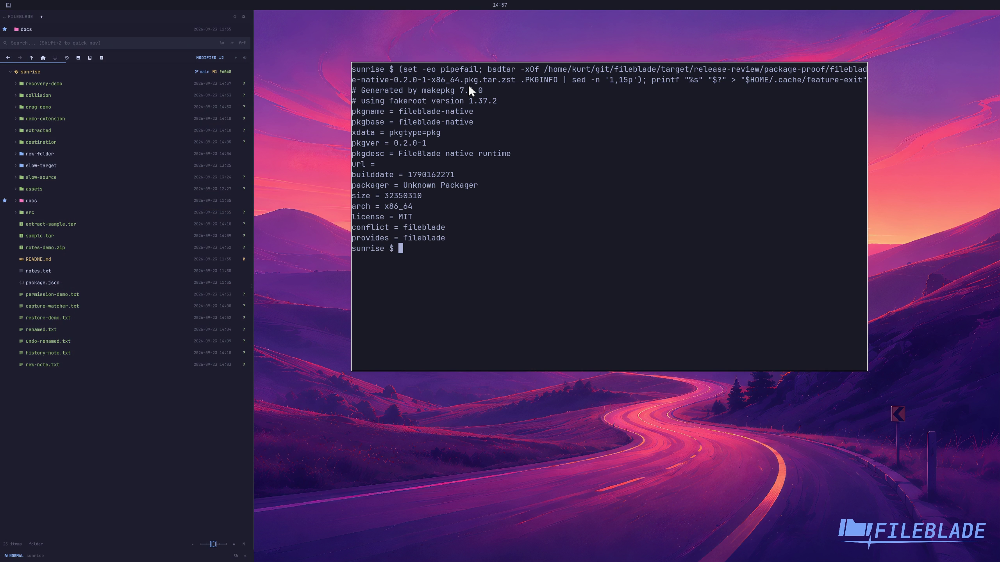

This file was written by an agent.

# Build the Arch package

Build an Arch package from an already verified native payload. The build validates the extracted package against its payload inventory.

```sh
packaging/build /path/to/payload /path/to/package-output
```

Demonstration: The built package reports its version, architecture, and dependencies.

The actual package build completed outside the short clip; the clip inspects its resulting metadata.

Evidence reviewed.



[Watch the focused demonstration](package.mp4) (5.97 seconds; muted, original speed).

Capture source: `c3e48bbee4f8e6c5adf0e12a3b1781ed6f6af833`. See the [evidence standard](../evidence.md) and [coverage](../catalog.json).
