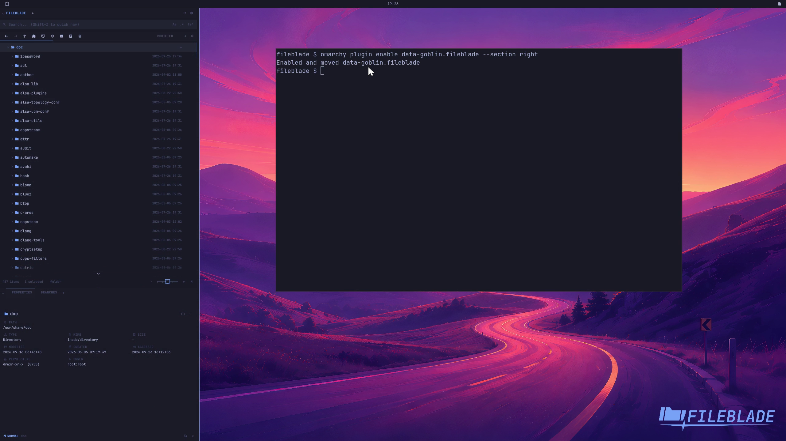

This file was written by an agent.

# Install the Omarchy plugin

Install FileBlade through Omarchy, then enable it to load the real sidebar and its bar button. The native installation route is separate.

```sh
omarchy plugin add https://github.com/data-goblin/fileblade.git
omarchy plugin enable data-goblin.fileblade --section right
```

Demonstration: Enabling the installed plugin loads its Files blade and restores the saved folder.

The clip focuses on activation of a local committed candidate. Add, update, disable, remove and a fresh shell restart were checked separately in the same disposable production host.

Evidence reviewed.



[Watch the focused demonstration](plugin-install.mp4) (5.97 seconds; muted, original speed).

Capture source: `9f661d66dbe275e7710da436569deb06e2a5d194`. See the [evidence standard](../evidence.md) and [coverage](../catalog.json).
