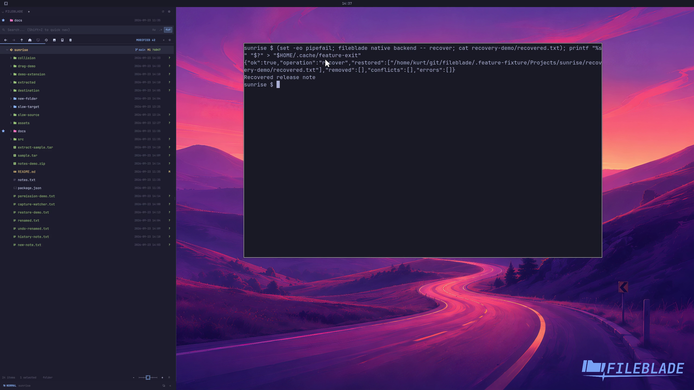

This file was written by an agent.

# Recover interrupted operations

FileBlade checks recorded in-flight operations so interrupted staged items can be recovered without silently overwriting another file.

```sh
fileblade native backend -- recover
```

Demonstration: The real recovery command restores a sample staged file and reports its path.

The interruption is represented by a documented fixture; the recording does not claim a process crashed.

Evidence reviewed.



[Watch the focused demonstration](recovery.mp4) (5.97 seconds; muted, original speed).

Capture source: `3db27943d1b3a31e155febf9cf0928fb7bb6eb63`. See the [evidence standard](../evidence.md) and [coverage](../catalog.json).
