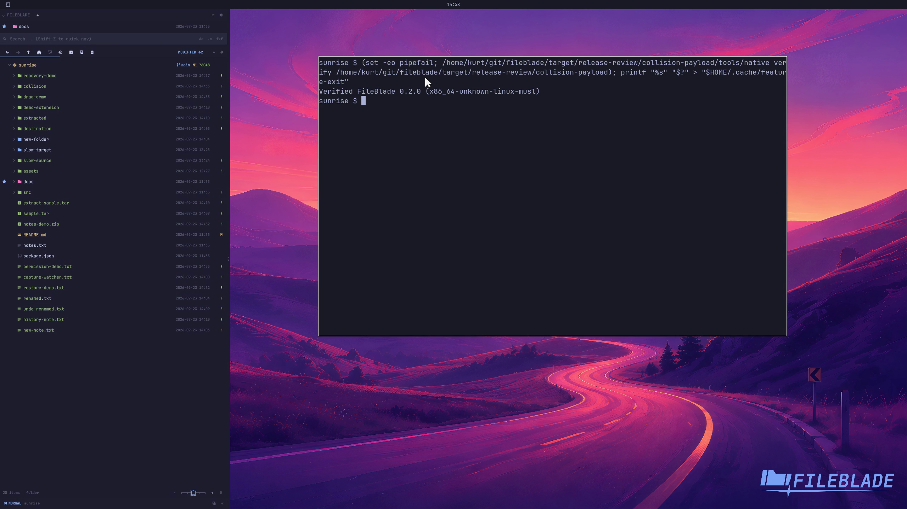

This file was written by an agent.

# Verify release payloads

Verify a payload before installation or packaging. Its inventory binds file paths, modes, hashes, version, architecture, and source identity.

```sh
PAYLOAD/tools/native verify PAYLOAD
```

Demonstration: The valid candidate payload passes its actual inventory verification.

Tamper and mixed-version refusal paths are covered by the regression gate, not shown in this clip. Checksums are not publisher signatures.

Evidence reviewed.



[Watch the focused demonstration](release-verification.mp4) (5.97 seconds; muted, original speed).

Capture source: `c3e48bbee4f8e6c5adf0e12a3b1781ed6f6af833`. See the [evidence standard](../evidence.md) and [coverage](../catalog.json).
