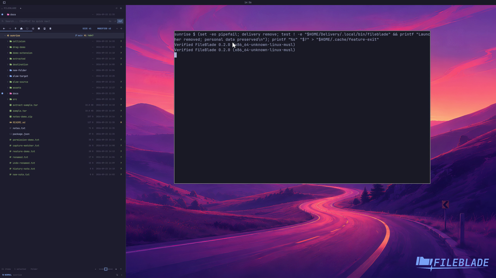

This file was written by an agent.

# Remove a native installation

Use the native installer's owned removal command to remove its application files and registrations. Saved personal state is retained.

```sh
PAYLOAD/tools/native remove
```

Demonstration: The disposable installation's stable launcher disappears while its sample personal data remains.

Evidence reviewed.



[Watch the focused demonstration](remove.mp4) (5.97 seconds; muted, original speed).

Capture source: `3db27943d1b3a31e155febf9cf0928fb7bb6eb63`. See the [evidence standard](../evidence.md) and [coverage](../catalog.json).
