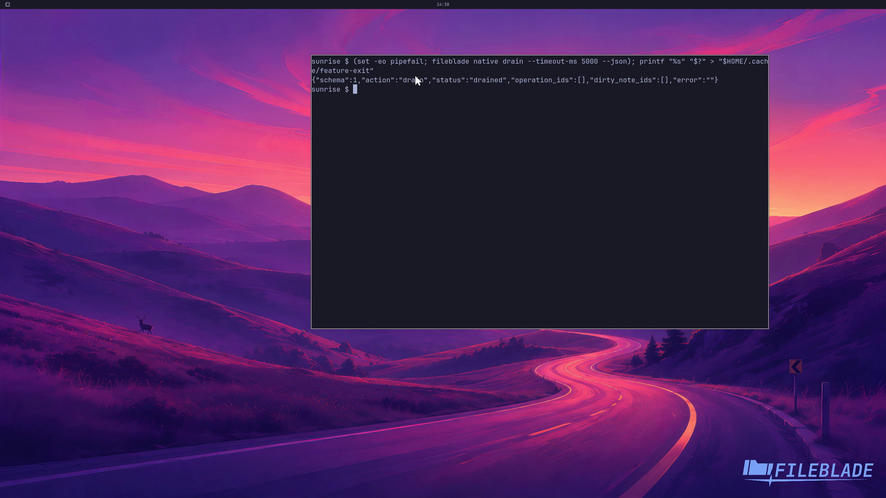

This file was written by an agent.

# Drain before maintenance

Drain the native runtime before maintenance. The result reports whether accepted work and state reached a safe stopping point.

```sh
fileblade native drain --timeout-ms 5000 --json
```

Demonstration: The disposable runtime reports that it drained and stopped.

The capture helper reopens that disposable runtime after recording.

Evidence reviewed.



[Watch the focused demonstration](safe-shutdown.mp4) (5.97 seconds; muted, original speed).

Capture source: `3db27943d1b3a31e155febf9cf0928fb7bb6eb63`. See the [evidence standard](../evidence.md) and [coverage](../catalog.json).
