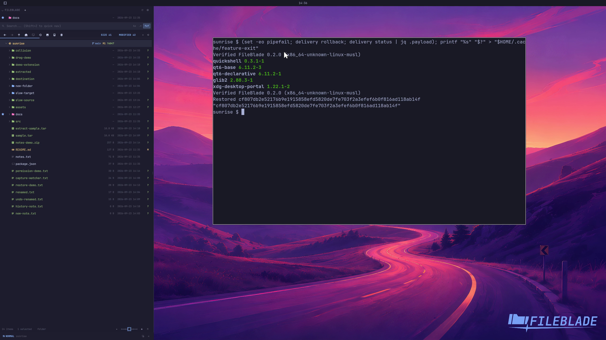

This file was written by an agent.

# Update and roll back

Installing another verified payload records the previous payload so the owned native installer can roll back.

```sh
PAYLOAD/tools/native rollback
PAYLOAD/tools/native status
```

Demonstration: The disposable installation switches back to its previously installed payload.

Both payloads are v0.2.0 review candidates with different source identities.

Evidence reviewed.



[Watch the focused demonstration](update-rollback.mp4) (5.97 seconds; muted, original speed).

Capture source: `3db27943d1b3a31e155febf9cf0928fb7bb6eb63`. See the [evidence standard](../evidence.md) and [coverage](../catalog.json).
