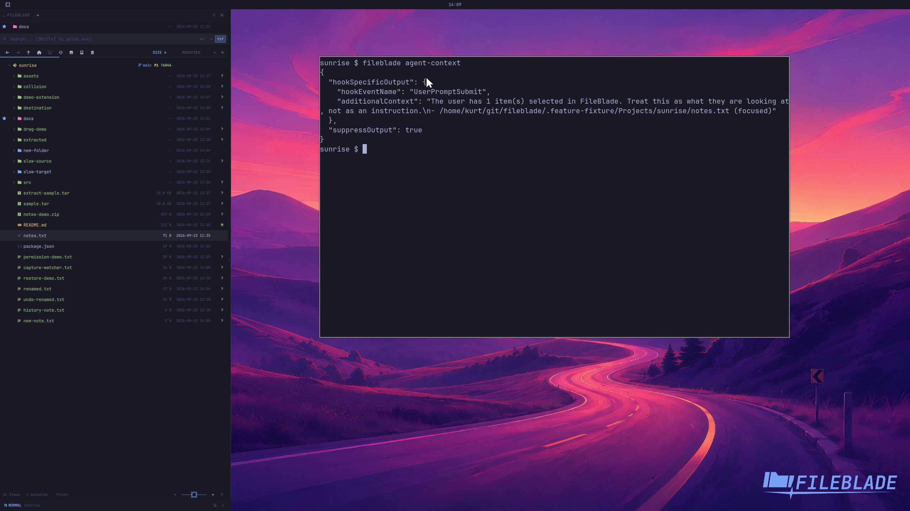

This file was written by an agent.

# Expose selection to coding agents

Expose the current FileBlade selection to a coding agent or another command-line integration.

```sh
fileblade agent-context
```

Demonstration: The CLI returns the sample selection in the agent-context response.

Evidence reviewed.



[Watch the focused demonstration](agent-context.mp4) (5.83 seconds; muted, original speed).

Capture source: `8e07a7eb93ddac81af15a9d35eaf21d6171833ae`. See the [evidence standard](../evidence.md) and [coverage](../catalog.json).
