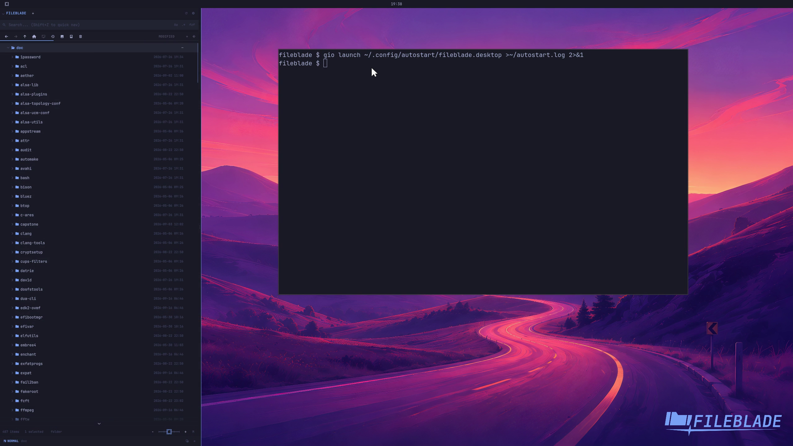

This file was written by an agent.

# Register native autostart

Opt into the native autostart role to install the login desktop entry. Its stable launcher starts FileBlade and restores the saved blade layout. Disable the role to reverse its owned registration.

```sh
fileblade native roles enable --role autostart
fileblade native roles status --json
```

Demonstration: After the runtime is drained, GIO launches the installed autostart desktop entry and the real native Files blade returns.

Proves registration and a cold desktop-entry launch. A full logout/login transition was not performed; the user's active desktop remains untouched.

Evidence reviewed.



[Watch the focused demonstration](autostart.mp4) (5.97 seconds; muted, original speed).

Capture source: `79930588b9957a17a316747b0df0c66ed42b3c6b`. See the [evidence standard](../evidence.md) and [coverage](../catalog.json).
