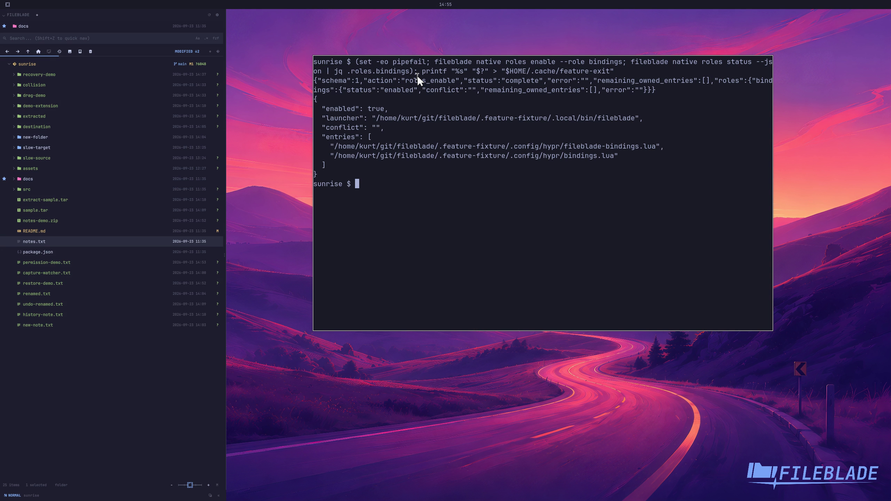

This file was written by an agent.

# Install blade keybindings

Opt into the native bindings role to install FileBlade's owned Hyprland include. Existing unrelated bindings are retained.

```sh
fileblade native roles enable --role bindings
fileblade native roles status --json
```

Demonstration: The role reports its owned binding files and enabled state.

The recording proves registration in a disposable profile, not activation in the working desktop's configuration.

Evidence reviewed.



[Watch the focused demonstration](bindings.mp4) (5.97 seconds; muted, original speed).

Capture source: `c3e48bbee4f8e6c5adf0e12a3b1781ed6f6af833`. See the [evidence standard](../evidence.md) and [coverage](../catalog.json).
