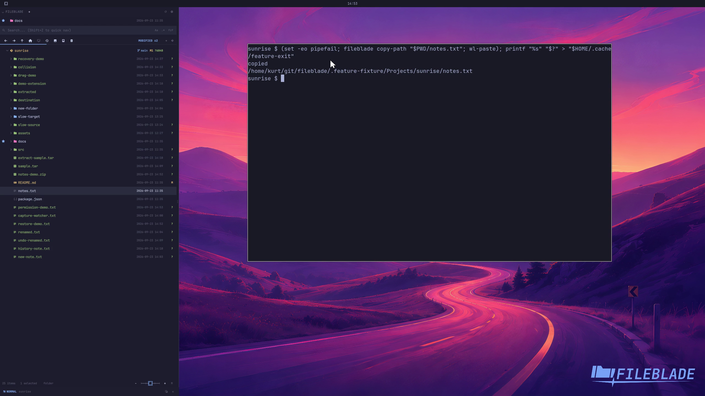

This file was written by an agent.

# Copy and paste paths

Copy the selected path to the clipboard, then paste it into another application.

```sh
fileblade copy-path /path/to/notes.txt
```

Demonstration: The real Wayland clipboard contains the selected sample path.

Evidence reviewed.



[Watch the focused demonstration](copy-path.mp4) (5.97 seconds; muted, original speed).

Capture source: `c3e48bbee4f8e6c5adf0e12a3b1781ed6f6af833`. See the [evidence standard](../evidence.md) and [coverage](../catalog.json).
