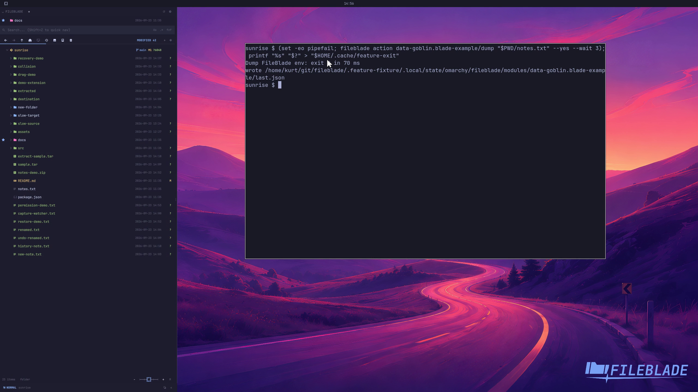

This file was written by an agent.

# Run an extension action

Extensions can declare actions that receive FileBlade's selected paths. Invoke an action from the UI or its public action command.

```sh
fileblade action data-goblin.blade-example/dump /path/to/notes.txt --yes --wait 3
```

Demonstration: The sample action receives the selected path and writes its expected result.

Evidence reviewed.



[Watch the focused demonstration](custom-actions.mp4) (5.97 seconds; muted, original speed).

Capture source: `c3e48bbee4f8e6c5adf0e12a3b1781ed6f6af833`. See the [evidence standard](../evidence.md) and [coverage](../catalog.json).
