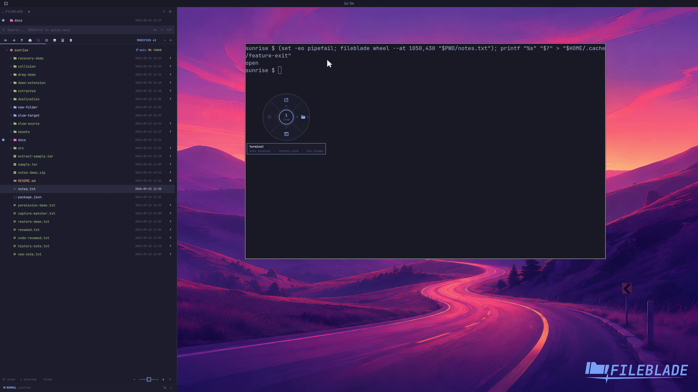

This file was written by an agent.

# Choose a drag action

Open the action wheel for selected paths over a target application. Available actions depend on the selection and target.

```sh
fileblade wheel --at 1200,430 /path/to/notes.txt
```

Demonstration: The wheel opens with actions resolved for the real terminal target.

The clip opens the wheel from the CLI; drag-trigger and action dispatch have separate demonstrations.

Evidence reviewed.



[Watch the focused demonstration](drop-wheel.mp4) (5.97 seconds; muted, original speed).

Capture source: `c3e48bbee4f8e6c5adf0e12a3b1781ed6f6af833`. See the [evidence standard](../evidence.md) and [coverage](../catalog.json).
