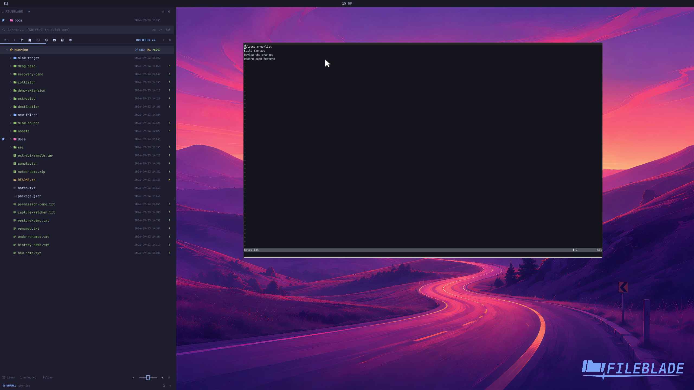

This file was written by an agent.

# Edit in the configured editor

Use Edit to open a file in the configured editor. This keeps the editor workflow accessible from either the tree or CLI.

```sh
fileblade edit /path/to/notes.txt
```

Demonstration: A real Neovim window opens the selected text file.

Evidence reviewed.



[Watch the focused demonstration](editor.mp4) (5.97 seconds; muted, original speed).

Capture source: `c3e48bbee4f8e6c5adf0e12a3b1781ed6f6af833`. See the [evidence standard](../evidence.md) and [coverage](../catalog.json).
