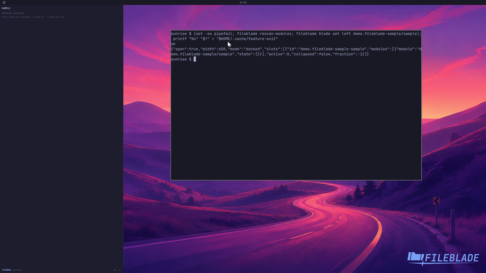

This file was written by an agent.

# Add an extension pane

Register a trusted native extension under ~/.config/fileblade/extensions/ID/manifest.json, rescan modules, then add its pane. See EXTENSIONS.md for the complete host contract.

```sh
fileblade rescan-modules
fileblade blade set left demo.fileblade-sample/sample
```

Demonstration: The generated sample extension loads as a real FileBlade pane.

Extensions execute local code and should come from a source you trust.

Evidence reviewed.



[Watch the focused demonstration](extensions.mp4) (5.97 seconds; muted, original speed).

Capture source: `c3e48bbee4f8e6c5adf0e12a3b1781ed6f6af833`. See the [evidence standard](../evidence.md) and [coverage](../catalog.json).
