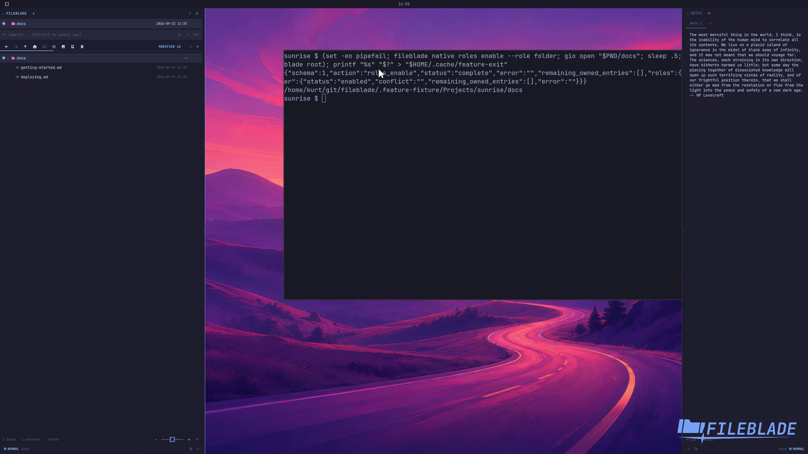

This file was written by an agent.

# Open folders with FileBlade

Enable the folder role when FileBlade should handle directory opens through the desktop.

```sh
fileblade native roles enable --role folder
```

Demonstration: Opening the sample docs folder through GIO hands it to FileBlade, which displays that folder.

The capture changes only the disposable profile's folder association.

Evidence reviewed.



[Watch the focused demonstration](folder-default.mp4) (5.97 seconds; muted, original speed).

Capture source: `c3e48bbee4f8e6c5adf0e12a3b1781ed6f6af833`. See the [evidence standard](../evidence.md) and [coverage](../catalog.json).
