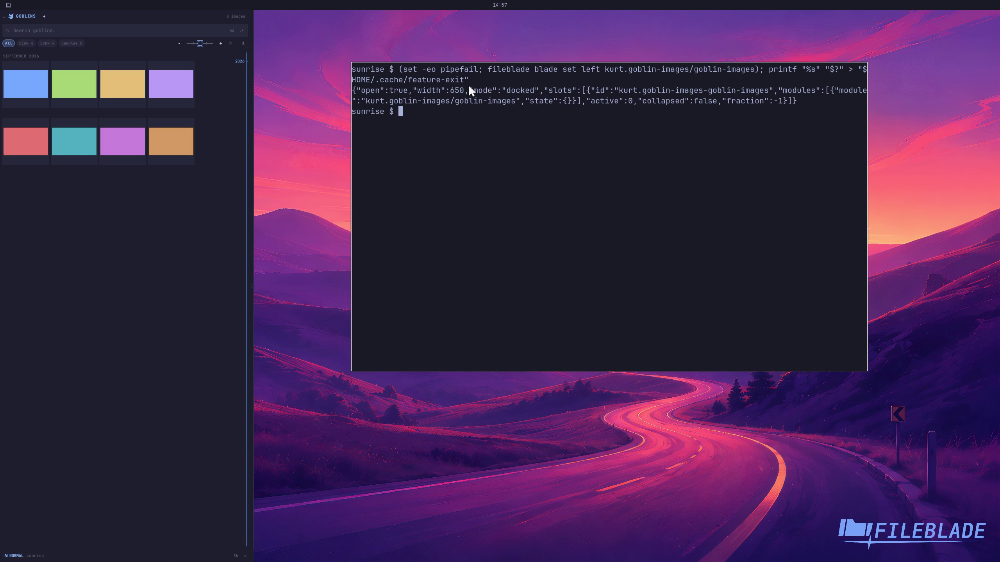

This file was written by an agent.

# Browse an extension image gallery

An extension can reuse FileBlade's shared image gallery. The provider supplies actual items; the host presents the gallery and selection.

```sh
fileblade blade set left kurt.goblin-images/goblin-images
```

Demonstration: The Goblins extension displays generated sample images from its real provider.

The library contains synthetic color-card images for demonstration.

Evidence reviewed.



[Watch the focused demonstration](gallery.mp4) (5.97 seconds; muted, original speed).

Capture source: `c3e48bbee4f8e6c5adf0e12a3b1781ed6f6af833`. See the [evidence standard](../evidence.md) and [coverage](../catalog.json).
