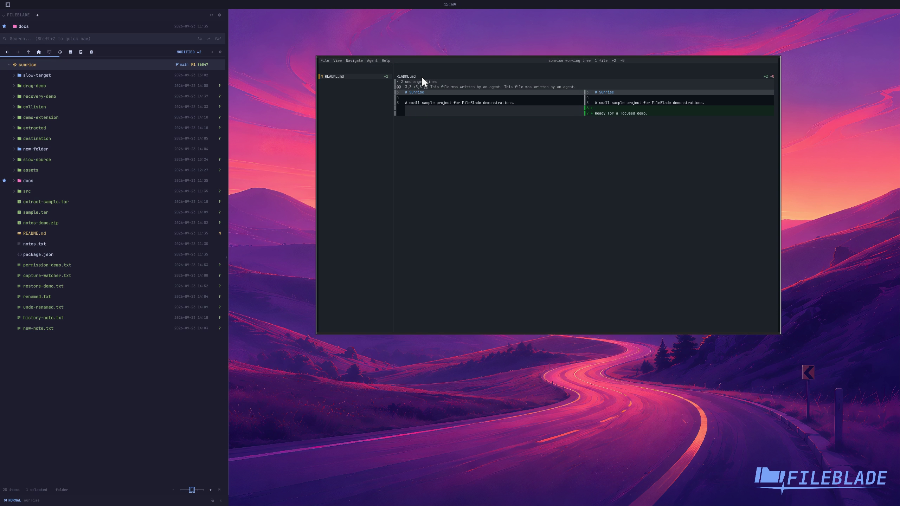

This file was written by an agent.

# Review changed files with Hunk

Use Review for a selected Git path with changes. FileBlade launches Hunk with the selected change context.

```sh
fileblade drop-run review /path/to/project/README.md --at 1200,220
```

Demonstration: Hunk opens the sample repository's changed file.

Hunk must be installed. The recording uses a disposable repository.

Evidence reviewed.



[Watch the focused demonstration](git-review.mp4) (5.97 seconds; muted, original speed).

Capture source: `c3e48bbee4f8e6c5adf0e12a3b1781ed6f6af833`. See the [evidence standard](../evidence.md) and [coverage](../catalog.json).
