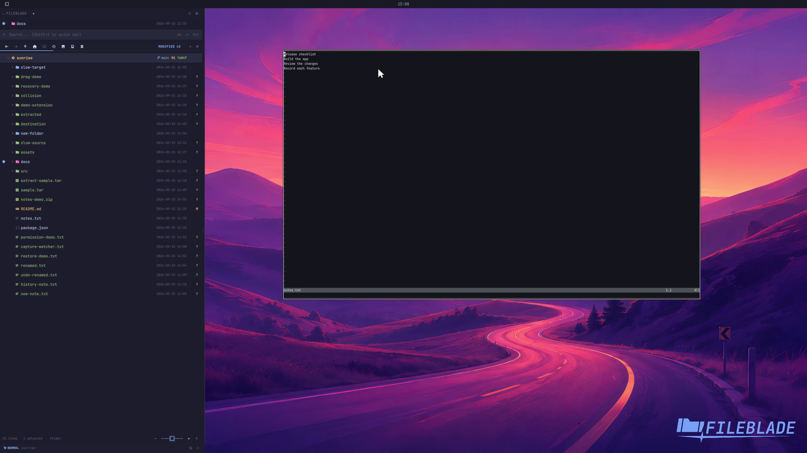

This file was written by an agent.

# Open files in applications

Open a selected file in its associated application. The target application receives the file path.

```sh
fileblade open /path/to/notes.txt
```

Demonstration: The sample text file opens in the capture profile's real associated editor.

Evidence reviewed.



[Watch the focused demonstration](open-files.mp4) (5.97 seconds; muted, original speed).

Capture source: `c3e48bbee4f8e6c5adf0e12a3b1781ed6f6af833`. See the [evidence standard](../evidence.md) and [coverage](../catalog.json).
