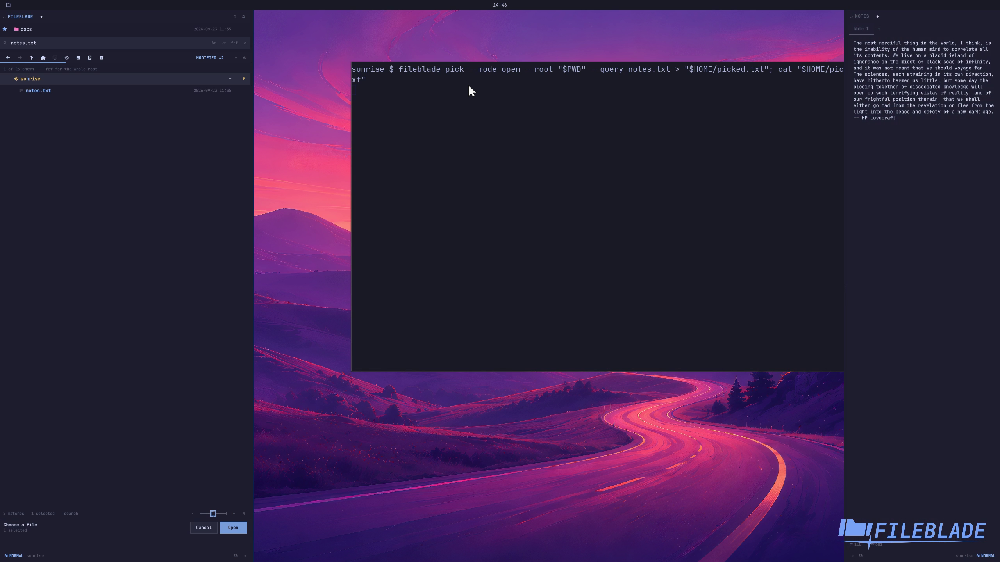

This file was written by an agent.

# Pick files from the CLI

Request a file selection from a shell command. Confirm the picker to receive the chosen path; cancelling returns without a selection.

```sh
fileblade pick --mode open --root /path/to/project --query notes.txt
```

Demonstration: A picker opened from the media grid displays ordinary files and returns the selected notes.txt path.

The media-grid preference remains saved after the picker closes.

Evidence reviewed.



[Watch the focused demonstration](picker.mp4) (6.9 seconds; muted, original speed).

Capture source: `c3e48bbee4f8e6c5adf0e12a3b1781ed6f6af833`. See the [evidence standard](../evidence.md) and [coverage](../catalog.json).
