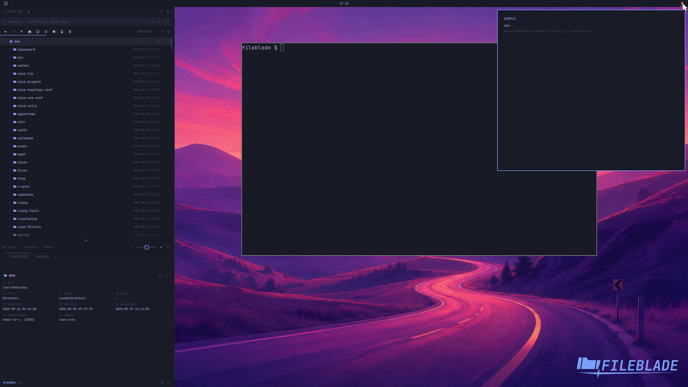

This file was written by an agent.

# Open an extension bar popout

FileBlade's Omarchy bar button opens a registered module in a popout. Choose the module in the bar widget settings; Escape or an outside click closes and unloads it.

```sh
fileblade popout publisher.name/module
fileblade popout
```

Demonstration: Clicking the actual FileBlade bar button opens the generated Sample extension in the production Omarchy shell.

Requires the Omarchy plugin runtime. Native extensions use blades. The generated extension is an explicit fixture; the host and registry are the real installed components.

Evidence reviewed.



[Watch the focused demonstration](popout.mp4) (5.73 seconds; muted, original speed).

Capture source: `9f661d66dbe275e7710da436569deb06e2a5d194`. See the [evidence standard](../evidence.md) and [coverage](../catalog.json).
