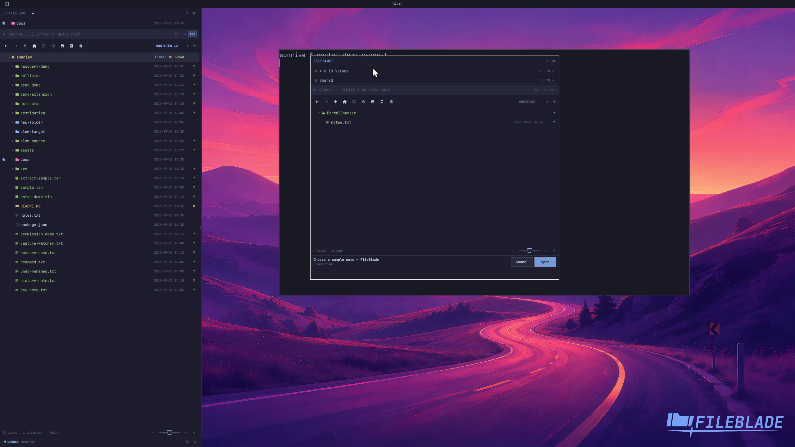

This file was written by an agent.

# Choose files for applications

Enable the chooser role to register FileBlade as a FileChooser portal backend. Applications request files through the desktop portal frontend.

```sh
fileblade native roles enable --role chooser
```

Demonstration: A client requests a file through the public desktop portal, selects notes.txt in FileBlade, and receives that exact file URI.

The real portal frontend and FileBlade backend run on a disposable session bus. They are started explicitly for this recording; automatic service activation is covered separately by native-role checks.

Evidence reviewed.



[Watch the focused demonstration](portal.mp4) (6.53 seconds; muted, original speed).

Capture source: `c3e48bbee4f8e6c5adf0e12a3b1781ed6f6af833`. See the [evidence standard](../evidence.md) and [coverage](../catalog.json).
