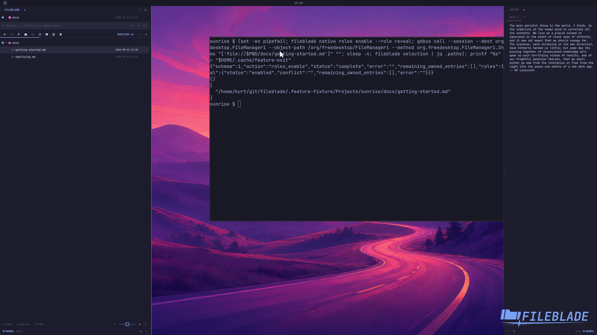

This file was written by an agent.

# Reveal a file through the desktop

Enable the reveal role to serve desktop FileManager1 reveal requests. A request opens the containing folder and selects the requested file.

```sh
fileblade native roles enable --role reveal
```

Demonstration: A real org.freedesktop.FileManager1.ShowItems call reveals and selects the requested document in FileBlade.

The D-Bus service is started explicitly on the disposable session bus; automatic activation is covered separately by the native-role regressions.

Evidence reviewed.



[Watch the focused demonstration](reveal.mp4) (5.97 seconds; muted, original speed).

Capture source: `5ecf61b6a03ffea34fe7317483668ec3464a1764`. See the [evidence standard](../evidence.md) and [coverage](../catalog.json).
