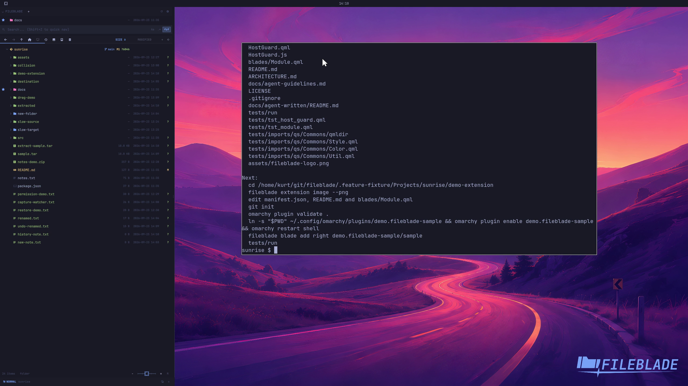

This file was written by an agent.

# Scaffold an extension

Generate an extension from the bundled template, then run the generated project's checks before customizing it.

```sh
fileblade extension template demo.fileblade-sample demo-extension
cd demo-extension
tests/run
```

Demonstration: The template generates a sample extension with its manifest and validation files.

The video shows generation; the full local code gate exercises the generated extension checks.

Evidence reviewed.



[Watch the focused demonstration](scaffolding.mp4) (5.87 seconds; muted, original speed).

Capture source: `8e07a7eb93ddac81af15a9d35eaf21d6171833ae`. See the [evidence standard](../evidence.md) and [coverage](../catalog.json).
