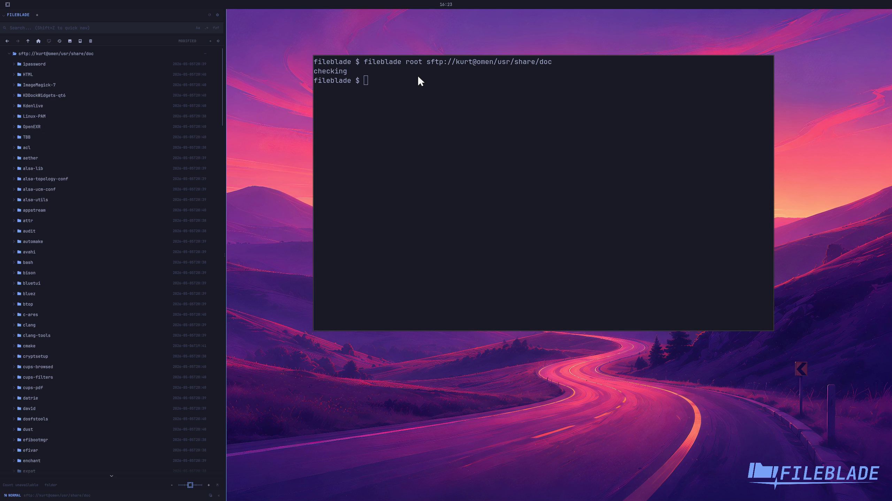

This file was written by an agent.

# Browse an SFTP location

Open a connected tailnet peer in the Files pane using its existing SSH authorization. Remote directory browsing is read-only.

This demonstration uses the explicitly chosen **Omen** peer, the configured SSH alias `omen`, user `kurt`, and `/usr/share/doc`. After connecting through Drives or the native backend, open the directory:

```sh
fileblade root sftp://kurt@omen/usr/share/doc
```

The pane switches from a local directory to Omen’s remote tree. The backend returned 230 entries, and the UI displayed the root plus those entries.



[Watch the focused demonstration](sftp.mp4) (5.97 seconds, muted, original speed).

The connection was established before recording. Separate real checks passed for tailnet discovery, a 4 ms ping, SSH/SFTP access, backend connect → refresh → list → disconnect, and the live integration regression. No remote files were changed. This proves authorized read-only browsing on Omen; it does not claim remote writes, transfers or other peers.

Testing found and fixed a connection-retention defect: refreshing locations discarded sessions created through a validated SSH alias because it compared that alias only with the full tailnet hostname. The live regression now checks that the connection and generation survive refresh before listing and disconnecting.

To repeat that regression against an explicitly authorized peer and nonempty directory:

```sh
FILEBLADE_SFTP_ALIAS=omen FILEBLADE_SFTP_DIRECTORY=/usr/share/doc \
  dbus-run-session -- cargo test --locked --test locations_sftp_live \
  configured_alias_survives_refresh_and_lists_remote_directory -- --ignored --exact
```

Capture source: `298244cd58b89977411a35822bbf333c44c610de`. Recorded in an isolated local Hyprland session on workspace 9, with wallpaper, a 650-pixel blade and the full SVG logo at equal 32-pixel visible right and bottom padding. See [coverage](../catalog.json) and [release readiness](../release/readiness.md).
