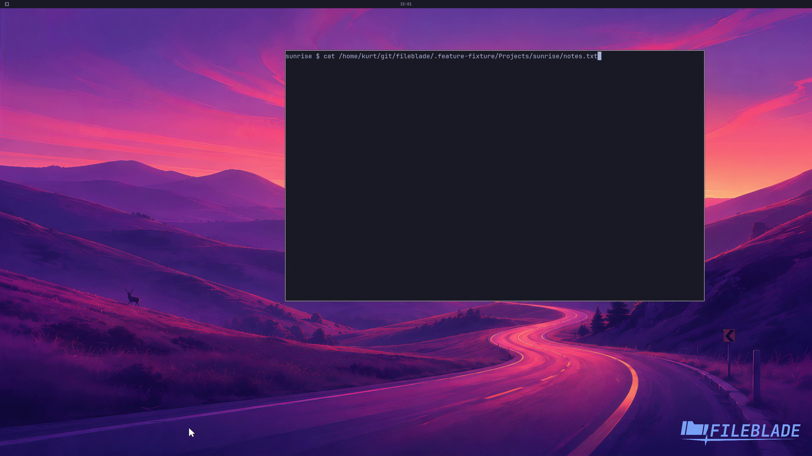

This file was written by an agent.

# Use shell selection widgets

Load the Bash or Zsh integration in your interactive shell. Ctrl+T replaces the current partial word with a selected, shell-quoted path.

```sh
eval "$(fileblade shell bash)"
```

Demonstration: The Bash widget opens the picker and inserts the chosen file into an unfinished command without executing it.

This recording covers Bash. Use fileblade shell zsh for the Zsh integration.

Evidence reviewed.



[Watch the focused demonstration](shell-widget.mp4) (7.93 seconds; muted, original speed).

Capture source: `c3e48bbee4f8e6c5adf0e12a3b1781ed6f6af833`. See the [evidence standard](../evidence.md) and [coverage](../catalog.json).
