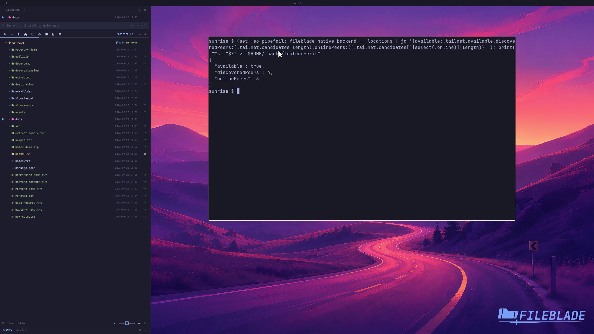

This file was written by an agent.

# Discover tailnet peers

The Drives integration discovers available Tailscale peers. Discovery does not itself connect to a peer or browse its files.

Demonstration: The backend returns the real session's discovered and online peer counts.

Host names and addresses are omitted from the recording.

Evidence reviewed.

[Watch the focused demonstration](tailnet.mp4) (5.97 seconds; muted, original speed).

Capture source: `c3e48bbee4f8e6c5adf0e12a3b1781ed6f6af833`. See the [evidence standard](../evidence.md) and [coverage](../catalog.json).
