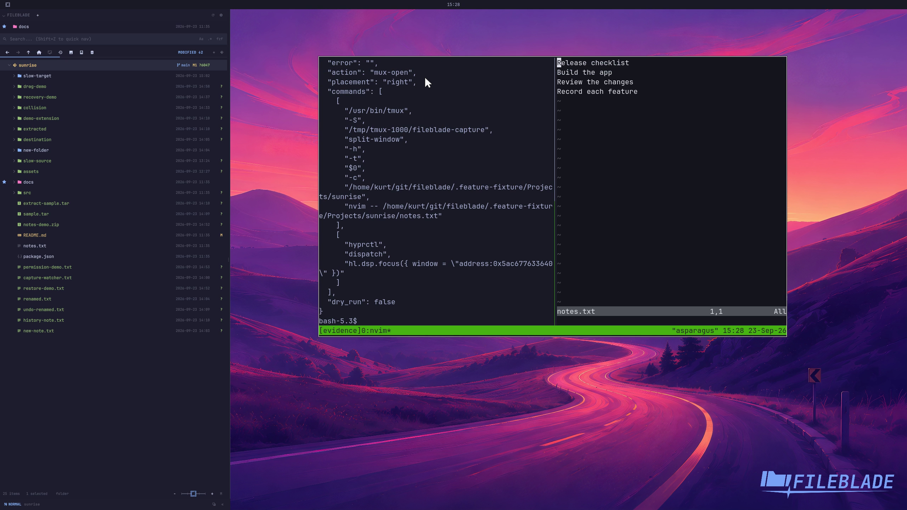

This file was written by an agent.

# Target terminal panes

A supported terminal multiplexer can receive files in a chosen placement. FileBlade resolves the live target pane before dispatching.

```sh
fileblade drop-run mux-open /path/to/notes.txt --placement right --at 1200,220
```

Demonstration: A real tmux target gains a right-hand pane containing the sample file.

This recording covers tmux; it does not qualify every supported terminal or multiplexer.

Evidence reviewed.



[Watch the focused demonstration](terminal-panes.mp4) (5.97 seconds; muted, original speed).

Capture source: `4bb83cac9105be43a65eb41a8d8f0012cdae2cab`. See the [evidence standard](../evidence.md) and [coverage](../catalog.json).
