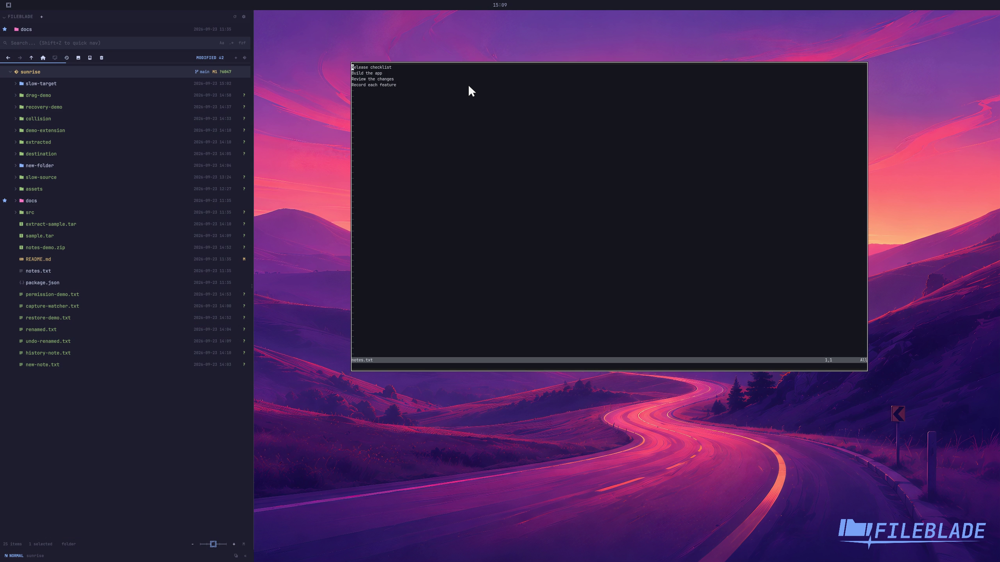

This file was written by an agent.

# Open a file in a new terminal

Open a selected text file in Neovim inside a new terminal. A folder-only selection opens a shell for that location.

```sh
fileblade drop-run terminal /path/to/notes.txt --at 1200,220
```

Demonstration: A new real terminal runs Neovim with the sample file.

Screen coordinates identify the target; replace them with a point on your own desktop.

Evidence reviewed.



[Watch the focused demonstration](terminal.mp4) (5.97 seconds; muted, original speed).

Capture source: `c3e48bbee4f8e6c5adf0e12a3b1781ed6f6af833`. See the [evidence standard](../evidence.md) and [coverage](../catalog.json).
