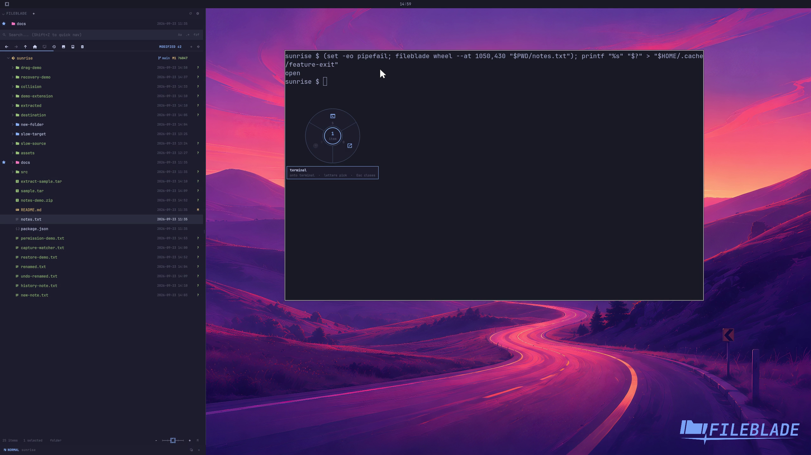

This file was written by an agent.

# Customize the drop wheel

Customize wheel order, labels, and visibility through the dropWheel member of FileBlade's existing settings document. Preserve its other preferences. See the linked configuration reference for the schema.

Demonstration: The real wheel shows the configured Shell here label and hides Open with.

The configuration is applied to the disposable profile; this is not a visual wheel editor.

Evidence reviewed.

[Watch the focused demonstration](wheel-configuration.mp4) (5.97 seconds; muted, original speed).

Capture source: `c3e48bbee4f8e6c5adf0e12a3b1781ed6f6af833`. See the [evidence standard](../evidence.md) and [coverage](../catalog.json).
