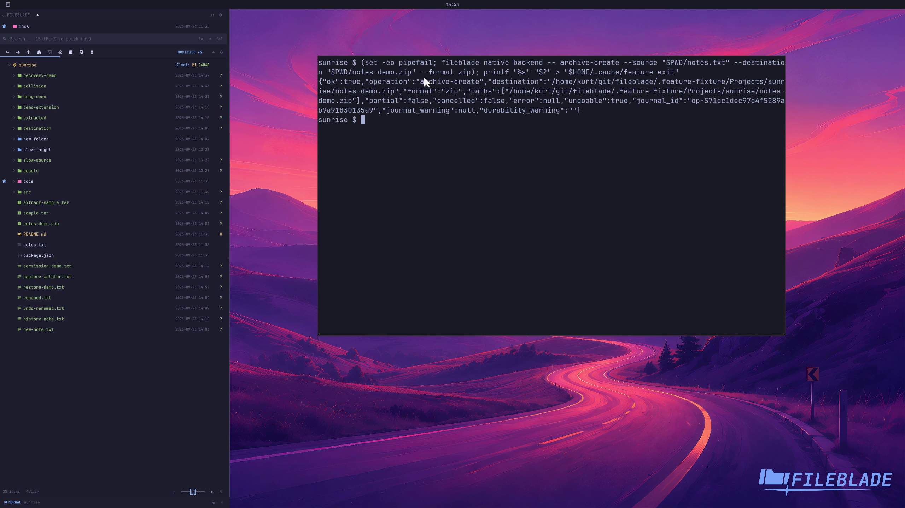

This file was written by an agent.

# Create an archive

Use Create archive from the file action menu to package selected files. The backend also exposes the operation for scripted integrations.

```sh
fileblade native backend -- archive-create --source /path/to/notes.txt --destination /path/to/notes.zip --format zip
```

Demonstration: A ZIP archive is created and its contents match the selected sample file.

The clip invokes the backend operation; it does not demonstrate the menu form.

Evidence reviewed.



[Watch the focused demonstration](archive-create.mp4) (5.97 seconds; muted, original speed).

Capture source: `c3e48bbee4f8e6c5adf0e12a3b1781ed6f6af833`. See the [evidence standard](../evidence.md) and [coverage](../catalog.json).
