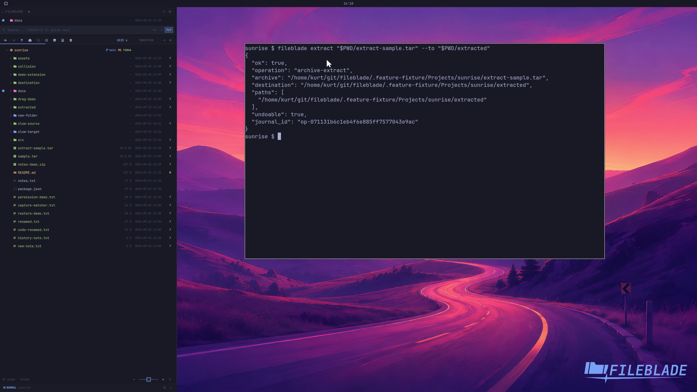

This file was written by an agent.

# Extract an archive

Extract a supported archive into a chosen destination. FileBlade reports the result and updates the folder tree.

```sh
fileblade extract /path/to/sample.tar --to /path/to/extracted
```

Demonstration: The expected sample members appear in the destination with their contents intact.

Evidence reviewed.



[Watch the focused demonstration](archive-extract.mp4) (5.87 seconds; muted, original speed).

Capture source: `8e07a7eb93ddac81af15a9d35eaf21d6171833ae`. See the [evidence standard](../evidence.md) and [coverage](../catalog.json).
