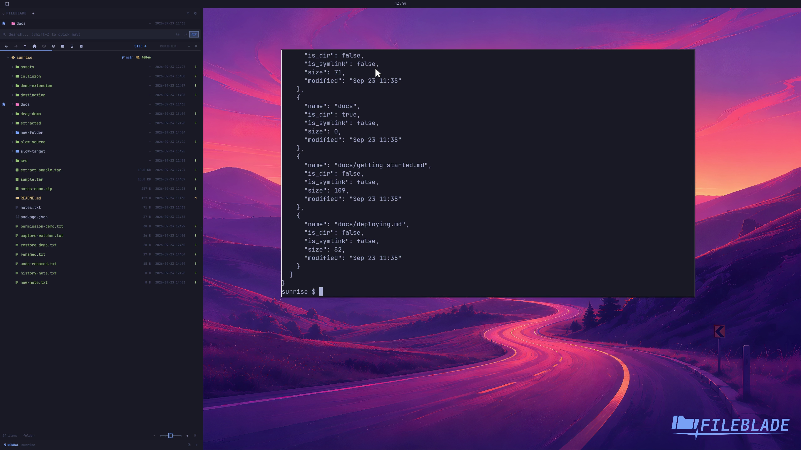

This file was written by an agent.

# Inspect archive contents

Inspect an archive's members before extracting it. Listing does not write those members into the destination filesystem.

```sh
fileblade archive-list /path/to/sample.tar
```

Demonstration: The real sample archive's member names are listed.

Evidence reviewed.



[Watch the focused demonstration](archive-list.mp4) (5.83 seconds; muted, original speed).

Capture source: `8e07a7eb93ddac81af15a9d35eaf21d6171833ae`. See the [evidence standard](../evidence.md) and [coverage](../catalog.json).
