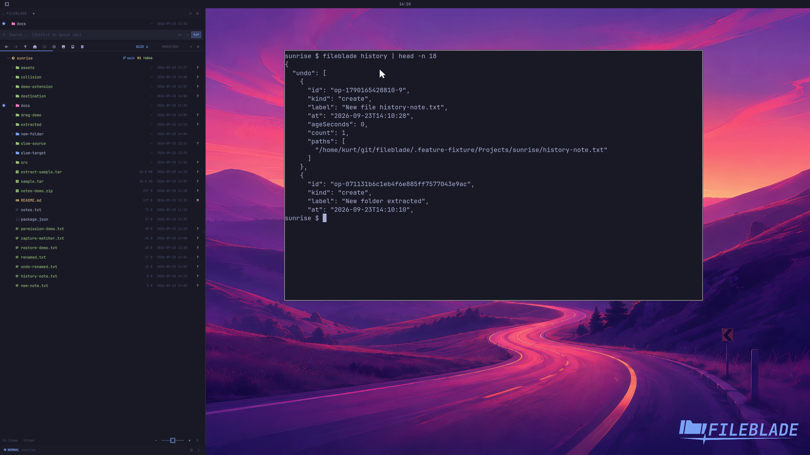

This file was written by an agent.

# Inspect operation history

Inspect the history of file operations performed through FileBlade. Entries describe completed actions and their outcomes.

```sh
fileblade history
```

Demonstration: The CLI shows real history entries from the disposable profile.

Evidence reviewed.



[Watch the focused demonstration](audit.mp4) (5.83 seconds; muted, original speed).

Capture source: `8e07a7eb93ddac81af15a9d35eaf21d6171833ae`. See the [evidence standard](../evidence.md) and [coverage](../catalog.json).
