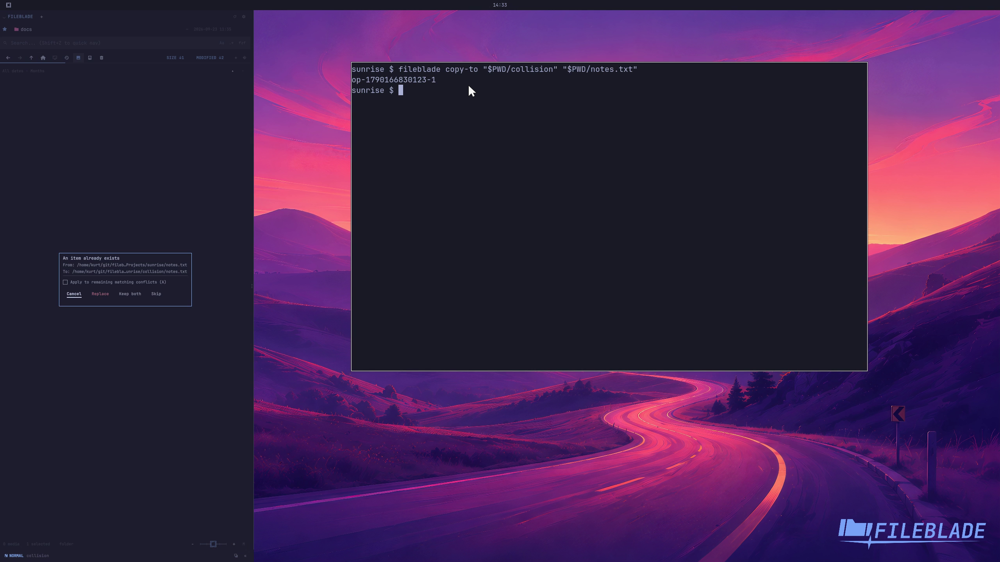

This file was written by an agent.

# Resolve destination conflicts

When a destination name already exists, choose how to resolve the collision in the dialog. Keep both preserves the existing file and gives the incoming file another name.

```sh
fileblade copy-to /path/to/destination /path/to/notes.txt
```

Demonstration: Keep both creates notes copy.txt while the original notes.txt remains unchanged.

Evidence reviewed.



[Watch the focused demonstration](conflicts.mp4) (5.63 seconds; muted, original speed).

Capture source: `3db27943d1b3a31e155febf9cf0928fb7bb6eb63`. See the [evidence standard](../evidence.md) and [coverage](../catalog.json).
