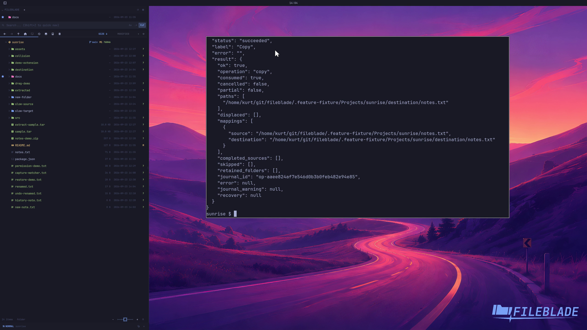

This file was written by an agent.

# Copy and paste files

Copy selected paths, navigate to a destination, and paste. The source remains available.

```sh
fileblade copy /path/to/notes.txt
fileblade paste /path/to/destination --wait
```

Demonstration: The destination receives a byte-identical copy while the source remains.

Evidence reviewed.



[Watch the focused demonstration](copy-paste.mp4) (5.87 seconds; muted, original speed).

Capture source: `8e07a7eb93ddac81af15a9d35eaf21d6171833ae`. See the [evidence standard](../evidence.md) and [coverage](../catalog.json).
