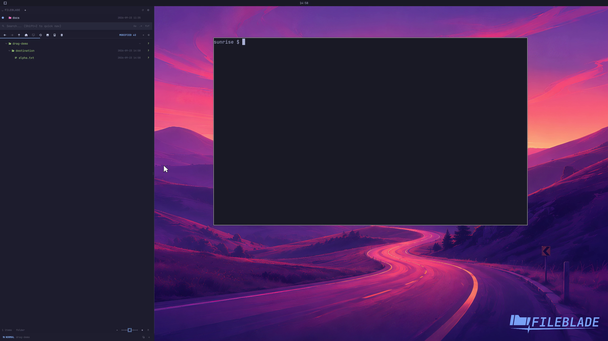

This file was written by an agent.

# Drag files between locations

Drag a file onto a destination folder in the tree. FileBlade performs the selected drag action and refreshes the affected locations.

Demonstration: A real pointer drag moves alpha.txt into the destination folder.

Evidence reviewed.

[Watch the focused demonstration](drag-drop.mp4) (5.6 seconds; muted, original speed).

Capture source: `c3e48bbee4f8e6c5adf0e12a3b1781ed6f6af833`. See the [evidence standard](../evidence.md) and [coverage](../catalog.json).
