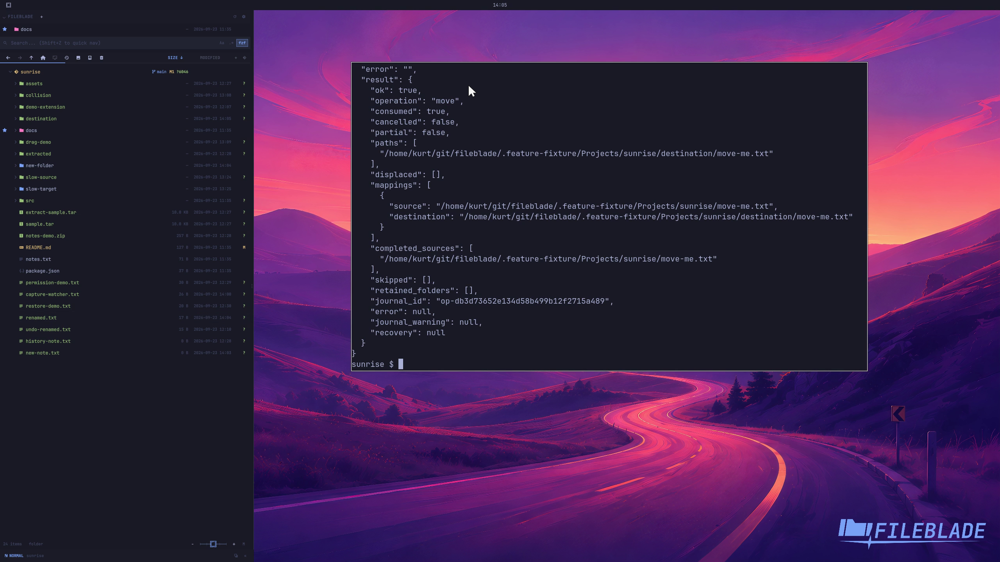

This file was written by an agent.

# Move files

Move selected files to a destination directory. A successful move removes their previous paths.

```sh
fileblade move-to /path/to/destination /path/to/move-me.txt --wait
```

Demonstration: The destination contains the sample file's original bytes and the old path is absent.

Evidence reviewed.



[Watch the focused demonstration](move.mp4) (5.87 seconds; muted, original speed).

Capture source: `8e07a7eb93ddac81af15a9d35eaf21d6171833ae`. See the [evidence standard](../evidence.md) and [coverage](../catalog.json).
