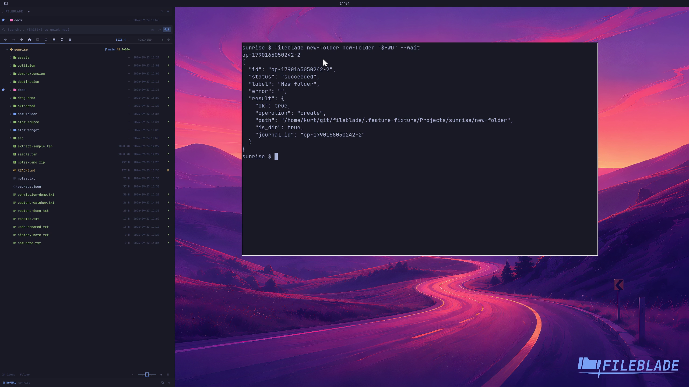

This file was written by an agent.

# Create a folder

Create a directory in the current or specified folder.

```sh
fileblade new-folder new-folder /path/to/project --wait
```

Demonstration: The new directory appears on disk and in Files.

Evidence reviewed.



[Watch the focused demonstration](new-folder.mp4) (5.87 seconds; muted, original speed).

Capture source: `8e07a7eb93ddac81af15a9d35eaf21d6171833ae`. See the [evidence standard](../evidence.md) and [coverage](../catalog.json).
