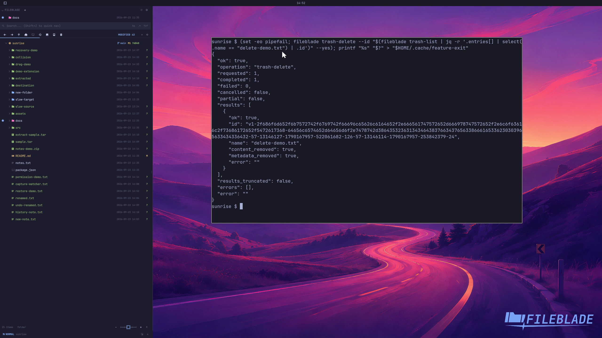

This file was written by an agent.

# Permanently delete Trash items

Permanently delete only the Trash entries you intend to remove. This action cannot be undone through Trash.

```sh
fileblade trash-delete --id ITEM_ID --yes
```

Demonstration: The selected disposable Trash item is removed permanently.

Evidence reviewed.



[Watch the focused demonstration](permanent-delete.mp4) (5.97 seconds; muted, original speed).

Capture source: `c3e48bbee4f8e6c5adf0e12a3b1781ed6f6af833`. See the [evidence standard](../evidence.md) and [coverage](../catalog.json).
