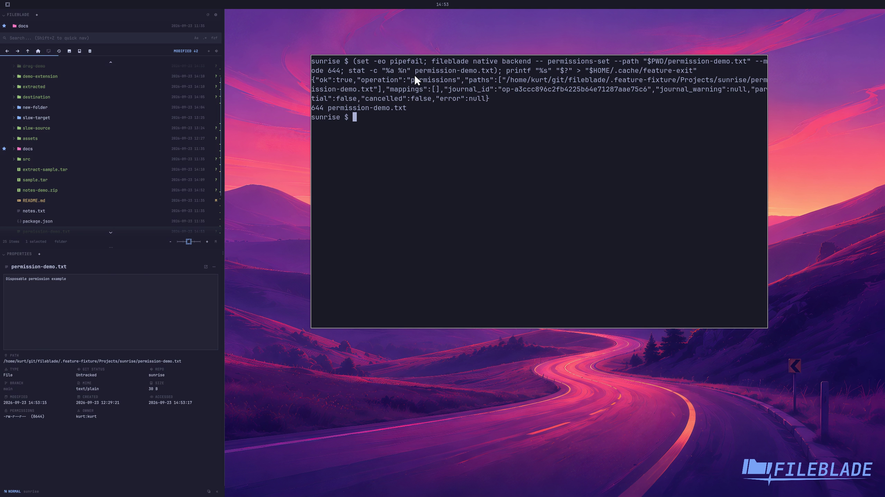

This file was written by an agent.

# Change file permissions

Use the permissions action for an eligible local file. Integrations can invoke the same backend operation with an octal mode.

```sh
fileblade native backend -- permissions-set --path /path/to/file.txt --mode 644
```

Demonstration: The sample file changes to mode 644, confirmed by filesystem metadata.

The clip proves the backend mutation, not interaction with the permissions form.

Evidence reviewed.



[Watch the focused demonstration](permissions.mp4) (5.97 seconds; muted, original speed).

Capture source: `c3e48bbee4f8e6c5adf0e12a3b1781ed6f6af833`. See the [evidence standard](../evidence.md) and [coverage](../catalog.json).
