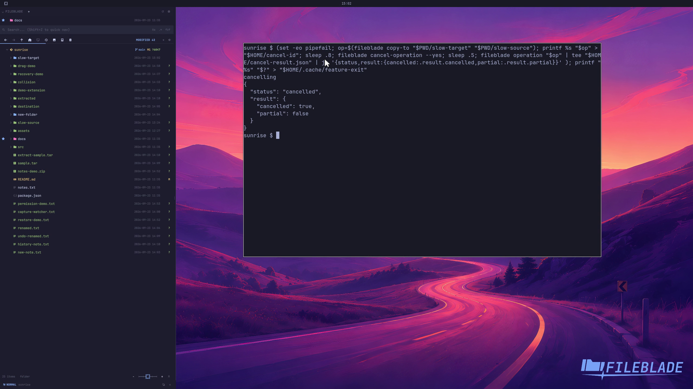

This file was written by an agent.

# Track and cancel work

Long-running work returns an operation identifier. Inspect the operation or request cancellation; the result distinguishes cancelled and partial work.

```sh
fileblade cancel-operation --yes
fileblade operation OPERATION_ID
```

Demonstration: A real multi-file copy is cancelled and reports its cancelled result.

The operation-result response is consumed when fetched; a later repeated query may report an unknown identifier.

Evidence reviewed.



[Watch the focused demonstration](progress-cancel.mp4) (5.97 seconds; muted, original speed).

Capture source: `c3e48bbee4f8e6c5adf0e12a3b1781ed6f6af833`. See the [evidence standard](../evidence.md) and [coverage](../catalog.json).
