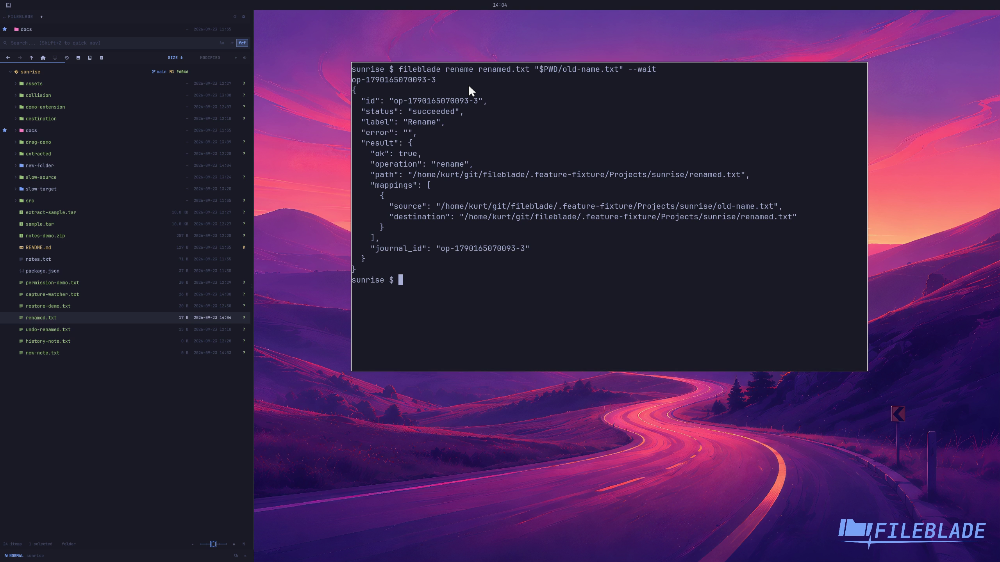

This file was written by an agent.

# Rename a file

Rename a file from its action menu or the CLI. Supply the new name and the existing path.

```sh
fileblade rename renamed.txt /path/to/old-name.txt --wait
```

Demonstration: The sample file changes name while retaining its contents.

Evidence reviewed.



[Watch the focused demonstration](rename.mp4) (5.87 seconds; muted, original speed).

Capture source: `8e07a7eb93ddac81af15a9d35eaf21d6171833ae`. See the [evidence standard](../evidence.md) and [coverage](../catalog.json).
