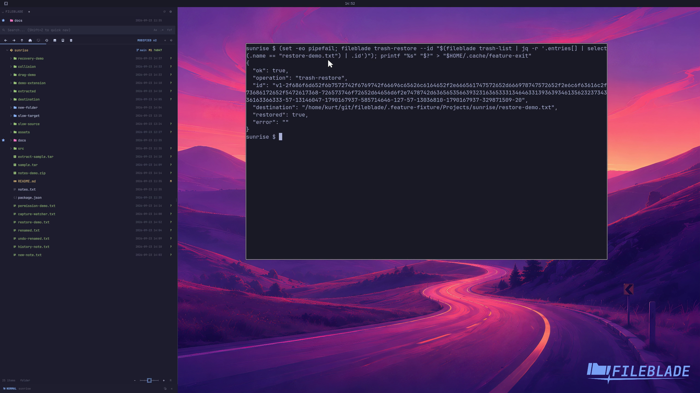

This file was written by an agent.

# Restore from Trash

Restore a selected Trash item to its original location. Use its item identifier rather than assuming names are unique.

```sh
fileblade trash-list
fileblade trash-restore --id ITEM_ID
```

Demonstration: The sample file returns from Trash with its original contents.

Evidence reviewed.



[Watch the focused demonstration](restore.mp4) (5.97 seconds; muted, original speed).

Capture source: `c3e48bbee4f8e6c5adf0e12a3b1781ed6f6af833`. See the [evidence standard](../evidence.md) and [coverage](../catalog.json).
