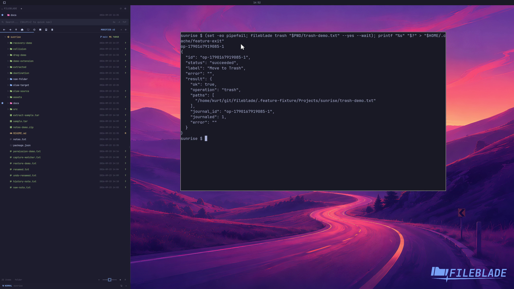

This file was written by an agent.

# Trash files

Move a disposable file to desktop Trash when you want a recoverable removal. The UI can ask for confirmation; the CLI requires an explicit confirmation flag for this example.

```sh
fileblade trash /path/to/trash-demo.txt --yes --wait
```

Demonstration: The file leaves its original folder and is discoverable in Trash.

Evidence reviewed.



[Watch the focused demonstration](trash.mp4) (5.97 seconds; muted, original speed).

Capture source: `c3e48bbee4f8e6c5adf0e12a3b1781ed6f6af833`. See the [evidence standard](../evidence.md) and [coverage](../catalog.json).
